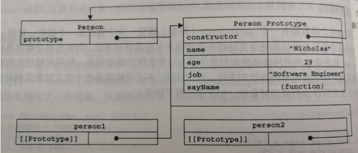

<Boxx/>
# JavaScript 高级程序设计

## 第一章：JavaScript 简介：

- 一、核心也是标准（ECMAScript）
- 二、文本对象模型（DOM）
- 三、浏览器对象模型(BOM)

### 1、ECMAScript：

指一种标准，JavaScript 的标准即是 ECMAScript 规定的，那么 ECMAScript 规定了哪些标准呢？

- 语法
- 类型
- 语句
- 关键字
- 保留字
- 操作符
- 对象

ECMAScript 就是对现该标准规定的各个方面的内容的语言的描述。JavaScript 实现了 ECMAScript，Adobe ActionScript 同样也实现了 ECMAScript

### 2、DOM:

- DOM1(DOM level1):主要目标是映射文档的结构，为两个模块组成：

  - DOM 核心（DOM Core）
  - DOM HTML

- DOM2，在 DOM1 的基础上扩充了鼠标和用户界面时间、范围、遍历等细分的模块：

  - DOM 视图（DOM Views）：定义了跟踪不同文档视图的接口
  - DOM 事件（DOM Events）：定义了事件和事件处理的接口
  - DOM 样式（DOM Styles）：定义了基于 CSS 为元素应用样式的接口
  - DOM 遍历和范围（DOM Traversal and Range）：定义了遍历和操作文档树的接口

- DOM3，进一步扩展了 DOM，引入了统一方式加载和保存文档的方法--在 DOM 加载和保存（DOM Load and Save）模块中定义；新增了验证文档的方法--在 DOM 验证（DOM Validation）模块中定义。DOM3 也对 DOM 核心进行了扩展，开始支持 XML 1.0 规范，设计 XML Infoset 、 XPath 和 XML Base。
- 其他 DOM 标准
  - 除了 DOM 核心和 DOM HTML 接口之外，另外集中语言还发布了只针对自己的 DOM 标准。下面列出的都是基于 XML 的
    - SVG（Scalable Vector Graphic ，可伸缩矢量图）
    - MathML（Mathematical Markup Language，数学标记语言）
    - SMIL（Synchronized Multimedia Integration Language，同步多媒体集成语言）

### 3、BOM：

从根本上讲，BOM 只处理浏览器窗口和框架；但人们习惯上也把所有针对浏览器的 JavaScript 扩展算作 BOM 的一部分。下面就是这样的一些扩展：

- 弹出新的浏览器窗口的功能
- 移动、缩放和关闭浏览器窗口的功能
- 提供浏览器详情信息的 navigator 对象
- 提供浏览器所加载页面的详细信息的 location 对象
- 提供用户显示器分辨率详细信息的 screen 对象
- 对 cookies 的支持
- 想 xMLHttpRequest 和 IE 的 ActiveXObject 这样的自定义对象

## 第二章：在 HTML 中使用 JavaScript

使用

```js
<script type="text/javascript" src="" ><script>
```

引入外部的 js 文件

使用 script 标签内部直接写 js 代码

## 第三章：JavaScript 的基本概念

```javascript
var floatNum = 3.125e7; //等于31250000--->3.125 * 10的7次方
```

### 数据类型

- ES5 中

  - undefined

  ```js
  // 声明未赋值 则为undefined
  var x;
  console.log(x); // undefined

  // 声明为undefined ，则 和 undefined是等价的
  var y = undefined;
  console.log(y === undefined); // true

  // 未声明直接引用会报错，但是用typeof 打印 则为undefined
  console.log(z);
  console.log(z === undefined);
  ```

  - null

  ```js
  // null值表示一个空对象指针，而这也正是使用typeof检测null会返回"object"的原因：
  var car = null;
  console.log(typeof car); // "object"

  // 定义变量的时候，变量初始值最好为null
  ```

  - boolean

  ```js
  // boolean 类型要注意的是 区分大小写，只认得 true 和 false 。TRUE、True和 FALSE、False都不认得
  ```

  
  - number

  ```js
  // 由于js精度的问题，导致，在js中 0.1 + 0.2 不会等于 0.3 ，这个时候就需要将 0.1和0.2 扩大10倍，再将最后的结果除以10；在我的vueTool中已经将此方法封装好了
  // number 属性中有个东西叫做 isNaN 的方法（NaN：非数值），用来判断一个数是否为数值，是返回false，不是返回true
  console.log(isNaN(NaN)); // true ：NaN不是数字，返回true
  console.log(isNaN(10)); // false ：10 是数字，返回false
  console.log(isNaN("10")); // false ：字符串数字会被转成number数字，所以返回10，返回false
  console.log(isNaN("blue")); // true ：字符串非数字不会被转成number类型，返回true
  console.log(isNaN(true)); // false ：true 为数字 1 ，返回false
  ```

  - Number：将所有的类型强转成 number 类型
    - Boolean 转成 0 或 1
    - null 返回 0
    - undefined 返回 NaN
    - 字符串：
      - 如果适合"123":返回 123，"011"返回 11，浮点类型也一样。
      - 空字符串，返回 0
      - 字符串中有特殊符号返回 NaN
    - 对象：（调用 valueof()）将其转换成字符串后，跟上面的方法一样
  - parseInt 和 parseFloat

    - parseInt()：将字符串转换为数字，第一个数必须是数字否则返回 NaN，如果第一个数是数字，则解析到非数字就停下：
      ```js
      console.log(parseInt("1234xxx")); // 1234
      console.log(parseInt("x2123")); //NaN
      console.log(parseInt(" ")); //NaN
      // parseInt()，还有个功能就是，第二个参数指定翻译成多少进制的数
      console.log(parseInt("AF", 16)); // 175
      ```
    - parseFloat()：和 parseInt 一样，无非就是多了小数点

  - string : 没什么好讲的。。。
  - object(function 特殊的 object)

  ```js
  // object 的每个实例都具有下列属性和方法
  constructor; // 保存着用于创建当前对象的函数，对于前面的例子而言，构造函数（constructor）就是object
  //用于检查给定的属性在当前的对象实例中（不是实例的原型中）是否存在，其中作为参数的属性名必须用字符串表示：
  // o.hasOwnProperty("name")
  hasOwnProperty(propertyName);
  isPrototyOf(object); // 用于检查传入的对象是否是传入对象的原型
  isPrototyIsEnumerable(propertyName); //用于检查给定的属性是否能够使用for-in，和hasOwnProperty一样必须以字符串形式传参
  toLocaleString(); //返回对象的字符串表示，该字符串和执行环境的地区对应
  toString(); //返回对象的字符串表示
  valueOf(); // 返回对象的字符串，数值或者布尔值表示，通常和toString的返回值一样
  ```

- ES6
  - symbol：表示独一无二的
- ES10
  - bigint

### 查看数据类型

- typeof 操作符

```js
typeof xxx -> "undefined" | "null" | "boolean" | "number" | "string" | "object" | "function"
typeof 返回的一定是个 字符串
typeof null; // 返回的是一个 object ，因为 null 是一个空的对象引用
```

从技术的角度讲，函数(Function)在 ECMAScribe 中是**对象**，而不是一种数据类型（书中可查），然而函数也是一种特殊的属性，所以通过 **typeof** 操作符来区分函数和其他对象，这是有必要的

### 操作符

- 乘/赋值 (\*=)
- 除/赋值 (/=)
- 模/赋值 (%=)
- 加/赋值 (+=)
- 减/赋值 (-=)
- 左移/赋值 (<<=) ->位运算
- 有符号右移/赋值 (>>=) ->位运算
- 无符号右移/赋值 (>>>=) ->位运算

## 第四章：JavaScript 变量、作用域和内存问题

### 基本类型和引用类型

在 JavaScript 中，是不允许直接访问内存中的位置，也就是说，不能直接操作对象的内存空间。
再操作对象的时候，其实是在操作对象的引用，而不是实际的对象。
在复制保存对象的某个变量的时候，操作的确实是引用。但是，在为对象添加属性时，操作的是实际的对象。

- 一个变量向另一个变量复制基本类型
  ```js
  var num1 = 5;
  var num2 = num1;
  // num1中保存的值是5，用num1来初始化num2，那么num2的值也是5
  // 但是他们两个的值是完全独立的，这两个值不会相互影响
  ```
  
- 一个变量向另一个变量复制引用类型
  ```js
  // 复制引用类型，相当于obj1和obj2同时指向同一个内存地址。
  // 所以当obj1改变数据的时候，obj2也可以访问的到
  var obj1 = new Object();
  var obj2 = obj1;
  obj.name = "shuaibi";
  console.log(obj2.name); // "shuaibi"
  ```
  
- 传递参数（复制可以分为按引用和按值，但传参只能按值）

  - 基本类型的传参

  ```js
  // 基本类型的传参，如同基本类型的复制一样
  // 实例1：
  function setName(obj) {
    obj.name = "Nicholas";
  }
  var person = new Object();
  setName(person);
  console.log(person.name); //"Nicholas"
  // 实例2：
  function setName(obj) {
    obj.name = "Nicholas";
    obj = new Object();
    obj.name = "jack";
  }
  var person = new Object();
  setName(person);
  console.log(person.name); //"Nicholas"
  // 说明：实际上，函数在内部重写obj的时候，这个变量引用就是一个局部对象了。而这个局部对象会再函数执行完毕后立即销毁
  ```

  - 引用类型的传参

  ```js
  // 引用类型的传参，如同引用类型的复制一样
  // 参数传递引用类型的值时，会把这个值在内存中的地址复制给一个局部变量，
  // 因此，这个局部变量的变化会反应在函数的外部
  // 实例1：
  function addTen(num) {
    num += 10;
    return num;
  }
  var count = 20;
  var result = addTen(count);
  console.log(count);
  console.log(result);
  ```

- 检测类型的方法

  - typeof 操作符（前面讲过了）
  - instanceof 操作符
  - Object.prototype.toString.call(a)

  ```js
  alert(Object.prototype.toString.call(a) === ‘[object String]’)-------> true;
  alert(Object.prototype.toString.call(b) === ‘[object Number]’)-------> true;
  alert(Object.prototype.toString.call(c) === ‘[object Array]’)-------> true;
  alert(Object.prototype.toString.call(d) === ‘[object Date]’)-------> true;
  alert(Object.prototype.toString.call(e) === ‘[object Function]’)-------> true;
  alert(Object.prototype.toString.call(f) === ‘[object Function]’)-------> true;
  ```

  ```js
  // 语法：
  result = variable instanceof constructor;

  console.log(person instanceof Object); //person 是 object 类型吗？true:false
  console.log(colors instanceof Array); //colors 是 Array 吗？true:false
  console.log(pattern instanceof RegExp); //pattern 是 RegExp 吗？true:false
  ```

- 执行环境
  - 全局变量和函数都是作为 window 对象的属性和方法创建的。某个环境中的所有代码执行完毕后，该环境销毁，保存在其中的所有变量和函数定义也随之被销毁（全局执行环境直到应用程序退出-例如关闭网页或浏览器-时才会被销毁）
  ```js
  var color = "blue";
  function changeColor() {
    if (color === "blue") {
      color === "red";
    } else {
      color = "blue";
    }
  }
  console.log("color is now" + color);
  // 说明函数外部的全局变量可在函数内部作用域中直接被引用
  ```
  ```js
  // 在局部作用域中定义的变量可以在局部环境中与全局变量互换使用
  var color = 'blue';
  function changeColor(){
    var anotherColor = 'red'
    function swapColors(){
      var tempColor = anotherColor;
      anotherColor = color;
      color = tempColor;
      // 这里可以访问 color、anotherColor 和 tempColor
    }
    // 这里可以访问 color 和 anotherColor ，但不能访问tempColor
    swapColors();
  }
  changeColor();
  // 以上代码包含三个执行环境：1、全局环境（window）、changeColor局部环境、swapColors局部环境
  // 通俗的讲就是：在作用域链中，子环境可以访问父环境甚至是祖父到window，但是父环境不能访问子环境的变量
  ├─ window                      全局环境（window）               //^
  |  ├─ color                    在全局变量中和changeColor平级    //|
  |  ├─ changeColor()                  changeColor局部环境        //|
  |  |  ├─ anotherColor                changeColor局部环境下的变量//|
  |  |  ├─ swapColors()                swapColors局部环境         //|
  |  |  |  ├─ tempColor                swapColors局部环境下的变量 //|
  ```
- 延长作用域

```js
function buildUrl() {
  var qs = "?debug=true";
  with (location) {
    var url = href + qs;
  }
  return url;
}
// with接收了location对象，因此其变量就包含了location对象的所有属性和方法，然后这个变量对象会被作为这个作用域的前端，可以理解成前缀
// 所以在引用href的时候，相当于引用了location.href
```

- js 没有块级作用域
- js 自己就具备的了垃圾回收的机制

  - 引用计数的循环引用问题

  ```js
  //Netscape Navigator3.0 中，对象不能相互引用，否则引用计数会认为这个对象一直在引用，永远得不到释放，将造成内存泄漏
  problem = () => {
    let obj1 = new Object();
    let obj2 = new Object();

    obj1.otherObject = obj2;
    obj2.anotherObther = obj1;
    // obj1和obj2相互引用，造成了内存泄漏
  };
  ```

  ```js
  // 为了解决相互引用而造成内存泄漏的问题，Netscape Navigator4.0放弃了引用计数的方法，转而采用了标记清除来实现垃圾回收
  ```

  **但是在 JavaScript 中，并不是所有的对象都是原生的 JavaScript 对象。其中 BOM 和 DOM 是使用了 C++以 COM（Component Object Model 组件对象模型）的对象形式实现的，而 COM 对象的垃圾回收机制依然是采用了引用计数。所以只要 IE 中涉及了 COM，那么就依然会有循环引用的问题**

  ```js
  let element = document.getElementById("some_element");
  let myObj = new Object();
  myObj.element = element;
  element.someObject = myObj;
  // 这个例子在一个 DOM 元素（element）和JavaScript原生对象（myObj）之间创建了循环引用，由于这个循环，使得，即使页面中的DOM移除了，它也永远不会被回收！！！
  // 所以为了实现垃圾回收的问题，我们一般主动断开这两者的循环调用
  myObj.element = null;
  element.someObject = null;
  ```

- JavaScript 内存管理
  ```js
  // 为了确保页面获取到更好的性能，最好的办法就是将不再使用的数据的值设置为null来释放内存---这个方法叫做解除引用：
  function createPerson(name) {
    var localPerson = new Object();
    localPerson.name = name;
    return localPerson;
  }
  var globalPerson = createPerson("Nicholas");
  //手动解除 globalPerson 的引用
  globalPerson = null;
  ```

## 第五章：引用类型

**虽然引用类型的样子看起来跟类很像，用法上看起来也很像，但是并不是一个东西。我们可以对引用类型称之为：对象定义**

### Object 类型：

```js
// 创建Object类型的两种方法
// 一、通过 new 创建
var person = new Object();
person.name = "jack";
person.age = 20;
// 二、对象字面量
// 对象字面量是对象定义的简写形式，如上面的person可以改成字面量形式
person = {
  name: "jack",
  age: 20,
};
// 属性名key值也可以是字符串
person = {
  "name/test": "jack",
  "age/test": 20,
  5: true,
};
//这边的5会被自动转成字符串,加"/test"是因为vscode格式化会默认把字符串改成最开始的对象字面量的形式

// 访问对象的方式也有两种，一种是通过·的方式，另一种是方括号语法
console.log(person.name); // jack
console.log(person["name"]); // jack
```

### Array 类型

```js
// 创建数组的方式有两种
// 一、使用数组的构造函数创建数组
var arr = new Array(); //创建了一个空数组，也可以直接new Array("color","name",123);
// 二、是使用数组的字面量表达法
var newArr = [1, 2, 3, "name"];
```

- 检测数组

```js
// 1、使用instanceof ES3
var arr = [];
if (arr instanceof Array) return "是个数组";
// 2、使用Array.isArray ES5
console.log(Array.isArray(arr)); //true
```

- 数组的转换对象

```js
var arr = ["red", "green", "blue"];
// toString()
arr.toString(); //"red","green","blue"
// valueOf()
arr.valueOf(); // ["red", "green", "blue"]
// toLocaleString()
arr.toLocaleString(); // "red","green","blue"
// join()
arr.join("|"); // "red"| "green"| "blue"
```

- 栈方法

```js
// 栈是一种先进后出的思想，数组中栈的思想体现在pop()：删除最后一项并返回被删除的项和push()：向后面加入一个数,并返回长度
var colors = new Array();
var count = colors.push("red", "green"); //推入两项
console.log(count); //2
count.push("blue");
console.log(colors); //["red","green","blue"]
var item = colors.pop();
console.log(item); //"blue"
```

- 队列方法

```js
// 队列是一种后进先出的思想，数组中栈的思想体现在shift()：删除最后一项并返回被删除的项和push()：向后面加入一个数,并返回长度
var colors = new Array();
var count = colors.push("red", "green"); //推入两项
console.log(count); //2
count.push("blue");
console.log(colors); //["red","green","blue"]
var item = colors.shift();
console.log(item); //"red"
```

```js
// javascript 提供了unshift （在数组前端添加任意的项，并返回数组长度）
var colors = new Array();
var count = colors.unshift("red", "green");
console.log(count);
```

- 重排序方法

```js
// js 提供两种排序方法sort()和reverse()
var values = [1, 2, 3, 4, 5];
values.reverse();
console.log(values); //[5,4,3,2,1],会改变原数组的值

var arr = [0, 1, 5, 10, 15];
arr.sort();
console.log(arr); //[0,1,10,15,5],会改变原数组，根据字符串结果进行比较，10和15之所以比5小是因为字符串第一个数是1,1比5小

// sort()方法可以接收一个函数作为参数来实现正常的大小排序

function compare(val1, val2) {
  if (val1 < val2) {
    return -1;
  } else if (val1 < val2) {
    return 1;
  } else {
    return 0;
  }
}
var newArr = [0, 1, 5, 10, 15];
newArr.sort(compare);
console.log(newArr); // [0, 1, 5, 10, 15]
```

- 操作方法

```js
// concat方法：基于当前数组再创建一个新数组
var colors = ["red","green","blue"];
var color2 = colors.concat("yellow",["black","grey"])；
console.log(colors);//["red","green","blue"]
console.log(color2);//["red","green","blue","yellow","black","grey"]

// slice()：基于当前数组中的一个或者多个项创建一个新数组，接收一或两个参数，就是要返回项的起始和结束的位置
var color3 = ["red","green","blue","yellow","black","grey"];
var color4 = color3.slice(1);//从第一个开始后面的全要，第0个不要
var color5 = color3.slice(1,4);//从第一个开始到第四个，第0个和第4个不要
console.log(color4);// ["green","blue","yellow","black","grey"];
console.log(color5);// ["green","blue","yellow"];

```

- splice()：数组中最强大的方法
  - 删除
  ```js
  var colors = ["red", "green", "blue"];
  var removed = colors.splice(0, 1); // 从第0项开始，删除一项
  console.log(colors); // ["green","blue"];
  console.log(removed); // "red"
  // 说明splice会改变原数组 ，会返回被删除的项
  ```
  - 插入
  ```js
  var colors = ["red", "green", "blue"];
  removed = colors.splice(1, 0, "yellow", "orange"); // 从第0项开始，删除0项，并添加yellow和orange
  console.log(colors); // "red","green","blue","yellow","orange"
  console.log(removed); // 返回一个[],因为并没有删除东西
  ```
  - 替换
  ```js
  var colors = ["red", "green", "blue"];
  removed = colors.splice(1, 1, "black", "skyblue"); // 从第1项开始删除一项，并插入两项
  console.log(colors); // "red","black","skyblue","blue"
  console.log(removed); // 返回一个["green"]
  ```
- 位置方法

```js
// 数组中有两个位置方法 indexOf() 和 lastIndexOf()。这两个方法都需要接收两个参数，要查找的项和查找起点位置的索引。其中indexOf()从数组位置0开始向后查找，lastIndexOf()则相反
var number = [1, 2, 3, 4, 5, 4, 3, 2, 1];
console.log(number.indexOf(4)); // 3,传入单个参数，这个参数代表值
console.log(number.lastIndexOf(4)); //5,传入单个参数，这个参数代表值
console.log(number.indexOf(4, 4)); //5，接收两个参数，要查找的项和查找起点位置的索引
console.log(number.lastIndexOf(4, 4)); //3，接收两个参数，要查找的项和查找起点位置的索引

var person = { name: "dashuaibi" };
var people = [{ name: "dashuaibi" }];
var morepeople = [people];
console.log(people.indexOf(person)); // -1 找不到会返回-1
console.log(morepeople.indexOf(person)); // 0 在位置0
```

- 迭代方法：js 数组自身提供 5 种迭代的方式

  - every：对数组的每一项运行给定，如果该函数对每一项都返回 true，则返回 true

  ```js
  var numbers = [1, 2, 3, 4, 5, 4, 3, 2, 1];
  var everyResult = numbers.every((item, index, array) => {
    return item > 2;
  });
  console.log(everyResult); //false
  ```

  - filter：对数组的每一项运行给定，返回该函数会返回 true 的项组成的数组

  ```js
  var numbers = [1, 2, 3, 4, 5, 4, 3, 2, 1];
  var filterResult = number.filter((item, index, array) => {
    return item > 2;
  });
  console.log(filterResult); // [3,4,5,4,3]
  ```

  - forEach：对数组的每一项运行给定，这个方法没有返回值

  ```js
  var numbers = [1, 2, 3, 4, 5, 4, 3, 2, 1];
  number.forEach((item, index, array) => {
    console.log(item * 2); // [2,4,6,8,10,8,6,4,2]
  });
  ```

  - map：对数组的每一项运行给定，返回每次函数调用结果组成的数组

  ```js
  var numbers = [1, 2, 3, 4, 5, 4, 3, 2, 1];
  var mapResult = number.map((item, index, array) => {
    return item * 2;
  });
  console.log(mapResult); // [2,4,6,8,10,8,6,4,2]
  ```

  - some：对数组的每一项运行给定，数组内任意一项返回 true，则直接返回 true

  ```js
  var numbers = [1, 2, 3, 4, 5, 4, 3, 2, 1];
  var someResult = numbers.some((item, index, array) => {
    return item > 2;
  });
  console.log(someResult); //true
  ```

- 归并方法：js 新增两个归并数组的方法

- reduce()；从第一个数组开始，遍历到最后

```js
// 接收四个参数：前一个值，当前的值，项的索引和数组对象
// 求和操作
var values = [1, 2, 3, 4, 5];
var sum = values.reduce((prev, cur, index, array) => {
  return prev + cur;
});
console.log(sum); //15
```

- reduceRight()；从最后一个开始，遍历到第一个

```js
// 接收四个参数：前一个值，当前的值，项的索引和数组对象
var values = [1, 2, 3, 4, 5];
var sum = values.reduceRight((prev, cur, index, array) => {
  return prev + cur;
});
console.log(sum); //15
```

### Date 类型

```js
var now = new Date();
// 如果要创建一个2004年5月25日的时间
var May25th = new Date(Date.parse("May 25,2004"));
var May25th_2 = new Date("May 25,2004"); // 后台会自动执行Date.parse()格式化字符串

// GMT 时间2000年1月1日午夜0时
var y2k = new Date(Date.UTC(2000, 0));
var y2k_2 = new Date(2000, 0);

// GMT 时间2005年5月5日下午5:55:55
var y2k = new Date(Date.UTC(2005, 4, 5, 17, 55, 55));
var y2k_2 = new Date(2005, 4, 5, 17, 55, 55);
```

- 日期格式化
  - toDateString()：以特定于实现的格式显示星期几，月，日和年
  - toTimeString()：以特定于实现的格式显示时、分、秒和时区
  - toLocaleDateString()：以特定于地区的格式显示星期几，月，日和年
  - toLocaleTimeString()：以特定于实现的格式显示时、分、秒和时区
  - toUTCString()：以特定于实现的格式显示时、分、秒和时区
  - toLocaleString()：以特定于实现的格式显示完整的 UTC 日期

### RegExp 类型

正则表达式。。。

### Function 类型

**函数声明式和函数表达式，在浏览器中并非一视同仁。声明式会被浏览器率先解析，而表达式则必须等到执行它所在的代码行，才会执行**

- 函数绑定

  - call()

  ```js
  function sum(num1, num2) {
    return num1 + num2;
  }
  function callSum(num1, num2) {
    return sum.call(this, num1, num2);
  }
  console.log(callSum(10, 10)); //20
  ```

  - apply()

  ```js
  function sum(num1, num2) {
    return num1 + num2;
  }
  function applySum(num1, num2) {
    return sum.apply(this, [num1, num2]);
  }
  console.log(applySum(10, 10)); //20
  ```

  - bind()

  ```js
  window.color = "red";
  var o = { color: "blue" };

  function sayColor() {
    console.log(this.color);
  }
  var objectColor = sayColor.bind(o);
  objectSayColor(); // "blue"
  ```

## 第六章：面向对象的程序设计

### 工厂模式

```js
// 工厂模式虽然解决了多个相似对象的问题，但是没有解决对象识别的问题
function createPerson(name, age, job) {
  var o = new Object();
  o.name = name;
  o.age = age;
  o.job = job;
  o.sayName = function() {
    alert(this.name);
  };
  return o;
}
```

### 构造函数模式

```js
// 构造函数的问题：
// 1、没有显示的创建对象；
// 2、直接将属性和方法写死
// 3、没有return
function Person(name, age, job) {
  var o = new Object();
  o.name = name;
  o.age = age;
  o.job = job;
  o.sayName = function() {
    alert(this.name);
  };
}
var person1 = new Person("jack", 29, "Software Engineer");
var person2 = new Person("greg", 21, "Doctor");
```

```js
// 任何函数通过new操作符调用，都可以成为构造函数。
// 反之任何构造函数一样可以当做普通函数或对象使用
// 衔接上面的Person构造函数

// 1、作为构造函数
var person = new Person("Nicholas", 29, "Software Engineer");
person.sayName(); //Nicholas
// 2、作为普通函数
Person("Greg", 21, "Doctor");
window.sayName(); //Greg
// 3、作为普通对象
var o = new Object();
Person.call(o, "kristen", 21, "Doctor");
o.sayName(); //kristen
```

### 原型模式

```js
function Person() {}
Person.prototype.name = "Nicholas";
Person.prototype.age = 29;
Person.prototype.job = "Software Engineer";
Person.prototype.sayName = function() {
  console.log(this.name);
};
var person1 = new Person();
person1.sayName(); // "Nicholas"
var person2 = new Person();
person2.sayName(); // "Greg"

console.log(person1.sayName === person2.sayName); //true
```

**不论什么时候，只要创建了一个函数，就会根据一组特定的规则为该函数创建一个 prototype 属性，这个属性指向函数的原型对象。在默认情况下，所有的原型对象都会获取一个 constructor（构造函数）属性，这个属性包含了一个指向 prototype 属性所在函数的指针，拿前面的例子来说 Person.prototype.constructor 指向了 Person。而通过了这个构造函数，我们还可以继续添加其他的方法**


- 继承
  在 Es5 中，继承只有实现继承，且实现继承主要是依靠原型链来实现的
- 原型链
  基本思想：利用原型，让一个引用类型继承另一个引用类型的属性和方法

## 第七章-函数表达式

### 函数声明式

```js
// 特点：声明函数可以放在调用方法的后面（函数声明提升）
sayHi();
function sayHi() {
  alert("Hi!");
}
```

### 函数表达式

```js
sayHi(); // 报错：函数不存在（不能像声明式那样有函数提升）
var sayHi = function() {
  alert("Hi!");
};
// 函数表达式：是匿名函数，因为没有标识符
```

### 递归

```js
// 阶乘递归例子：
function factorial(num) {
  if (num <= 1) {
    return 1;
  } else {
    // return num * factorial(num - 1) // 这样写的话，被拿来赋值的时候，指向可能会出问题
    return num * arguements.callee(num - 1);
  }
}

// 用匿名函数也可以解决这个问题
var factorial_2 = function f(num) {
  if (num <= 1) {
    return 1;
  } else {
    return num * f(num - 1);
  }
};
```

### 闭包

**闭包是指有权访问另一个函数作用域中农的变量的函数**

#### 闭包和变量

问题：闭包只能取得包含函数中任何变量的最后一个值

```js
function createFunctions() {
  var result = new Array();
  for (var i = 0; i < 10; i++) {
    result[i] = function() {
      return i;
    };
  }
  return result; // 只会返回10
}
```

要解决上面的问题，我们需要通过另一个匿名函数，强制让闭包行为符合预期

```js
function createFunctions() {
  var result = new Array();
  for (var i = 0; i < 10; i++) {
    result[i] = (function(num) {
      return function() {
        return num;
      };
    })(i);
  }
  return result; //给每一次的匿名函数都传入一个变量i，并将立即执行的结果返回给数组，最终返回的结果就是[1,2,3……,10]
}
```

#### this 指向的问题

this 对象是在运行时基于函数的执行环境绑定的。**但是匿名函数的执行环境是具有全局性的，所以 this 通常指向 window**

```js
var name = "The Window";
var object = {
  name: "My Object",
  getNameFunc: function() {
    return function() {
      return this.name;
    };
  },
};
setTimeout(() => {
  this.name = "time out";
  console.log(object.getNameFunc()()); // "time out" (Es6箭头函数的this指向它本身)
});
console.log(object.getNameFunc()()); // "The Window" (在非严格条件下)
```

```js
// 解决办法：
var name = "The Window";
var object = {
  name: "My Object",
  getNameFunc: function() {
    var _this = this;
    return function() {
      return _this.name;
    };
  },
};
console.log(object.getNameFunc()()); // "My Object" (在非严格条件下)
// 还有一种办法，利用es6的箭头函数
```

##### 闭包内存泄漏问题

- 1、如果闭包中含有一个 html 元素，那么久意味着该元素无法被销毁

```js
// 这边的方法中element调用了匿名函数，只要匿名函数存在，那么element就无法被销毁，说明即便assignHandle已经执行完毕了，element也没有被销毁，内存中依然存在
function assignHandle() {
  var element = document.getElementById("someElemnt");
  element.onclick = function() {
    console.log(element.id);
  };
}
// 为解决这个问题，我们可以通过将element.id的一个副本保存在一个变量中，并且在闭包中引用该变量消除了循环引用，但仅仅做到这一步还是无法解决内存泄漏的问题，必须将闭包函数的引用置为null才可以
function assignHandle() {
  var element = document.getElementById("someElemnt");
  var id = element.id;
  element.onclick = function() {
    console.log(element.id);
  };
  element = null;
}
```
#### 模仿块级作用域
```js
// 在js中，块级作用域一般为匿名函数，成为私有作用域
(function(){
  // 块级作用域
})()
```
#### 私有变量
```js

```