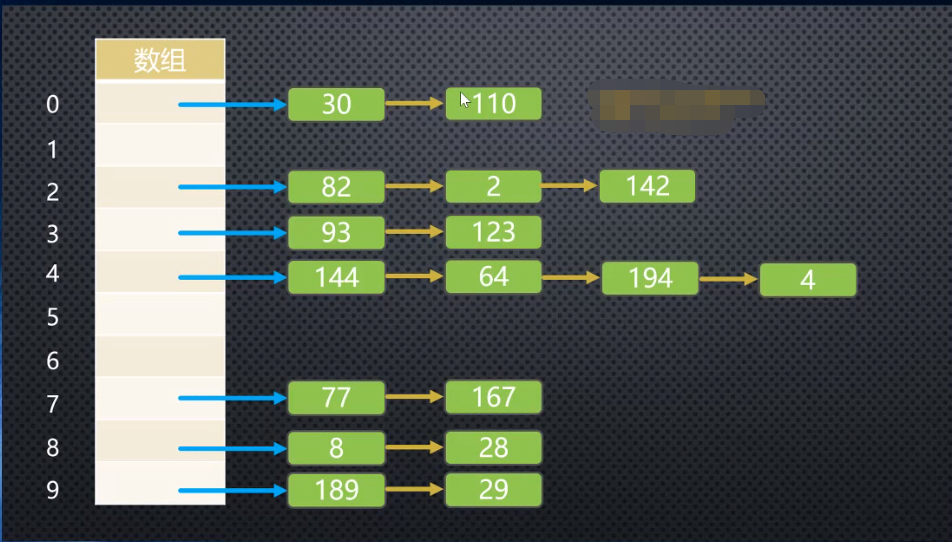

# 数据结构之哈希表

## 解决哈希表冲突：

1、链地址法：

方法一：数组的形式：（新数据使用频率低，用数组链表都行）

```JavaScript
[[30,110],[82,2,142],[93,123],[144,64,194,4]...]
//这样做的好处是每次可以通过下标找到对应的数组，然后再从数组中取值，
//数组查询的速度比链式快
```

方法二：链的形式：（新数据使用频率高，选用链表）

```JavaScript
[{30,next:{110}},{82,next:{2,next:{142}}},...]
//链式的好处就是增删改会比数组更快
```

## 开放地址法


## 设计哈希函数---霍纳算法

```js
  // 设计哈希函数
      // 1、将字符串转成较大的数字，hashCode
      // 2、将大的数字hashCode压缩到数组范围(大小)之内
      function HashFunc(str, size) {
        // 1、定义hashCode的变量
        let hashCode = 0;
        // 2、霍纳算法，计算hashCode的值
        // 例如：cats->unicode编码
        for (let i = 0; i < str.length; i++) {
          hashCode = 37 * hashCode + str.charCodeAt(i);
        }
        // 3、取余操作
        let index = hashCode % size;
        return index;
      }
```

