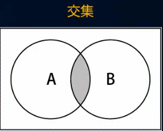
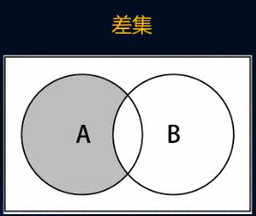
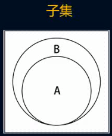

<Boxx/>
# 数据结构之集合、字典

## 集合学习：

```javascript
 function Set() {
        // 属性:集合为一个对象
        let items = {};
        //  add(value):向集合添加一个新的项
        Set.prototype.add = function (value) {
          // 判断是否存在这个值
          if (this.has(value)) return false;
          this.items[value] = value; //创建一个键值名都一样的元素，添加到集合中
          return true;
        };
        //  remove(value):从集合移除一个值
        Set.prototype.remove = function (value) {
          // 判断集合中是够包含该元素
          if (!this.has(value)) return false; //不包含则直接return false
          delete items[value];
          return true;
        };
        //  has(value):如果值在集合中，返回true，否则返回false
        Set.prototype.has = function (value) {
          return this.items.hasOwnProperty(value); //JS自带查看对象属性是否包含这个值的方法
        };
        //  clear():移除集合中所有项
        Set.prototype.clear = function(){
          this.items = {}
        }
        //  size():返回集合包含的所有元素的数量
        Set.prototype.size = function(){
          return Object.keys(this.items).length
        }
        //  values():返回一个包含集合中所有值的数组
        Set.prototype.values = function(){
          return Object.keys(this.items)
        }
      }
```

## 集合并集：


```javascript
  // 集合并集的操作
        Set.prototype.union = function(otherSet){
          // 创建一个新的集合
          let unionSet = new Set()
          // 将A集合中的所有的元素添加到新的集合中
          let values = this.values()
          for (let i = 0; i < values.length; i++) {
            unionSet.add(values[i]);
          }
          // 将B集合中的所有的元素添加到新的集合中
          for (let i = 0; i < otherSet.length; i++) {
            unionSet.add(otherSet[i]);
          }
          return unionSet
        }
```

## 集合交集：




```javascript
   // 集合交集
        Set.prototype.intersection = function (otherSet) {
          // 创建新的集合
          let intersectionSet = new Set();
          // 从A中取出所有的元素，并查看是否在B中也存在，将共同存在的元素放到新的集合中
          let values = this.values();
          for (let i = 0; i < values.length; i++) {
            let item = values[i];
            if (otherSet.has(item)) {
              intersectionSet.add(item);
            }
          }
          return intersectionSet;
        };
```

## 集合差集：




```javascript

        // 差集
        Set.prototype.difference = function(otherSet){
            // 创建新的集合
            let differenceSet = new Set();
          // 从A中取出所有的元素，并查看是否在B中不存在，将不是交集的元素放到新的集合中
          let values = this.values();
          for (let i = 0; i < values.length; i++) {
            let item = values[i];
            if (!otherSet.has(item)) {
              differenceSet.add(item);
            }
          }
          return differenceSet;
        }
```

## 集合子集：



```javascript
  // 子集
        Set.prototype.subset = function(otherSet){
          // 遍历集合A中所有的元素，如果发现集合A中的元素，在集合B中不存在，那么return false
          // 如果遍历了整个集合，依然没有返回false，那么返回true即可
          let values = this.values()
          for (let i = 0; i < values.length; i++) {
            let items = values[i]
            if(!otherSet.has(item))return false
          }
        }
        return true
```


## 字典的主要特点

- 字典的主要特点是：一一对应
- 比如保存一个人的信息，在合适的时候取出这些信息
- 使用数组的方式:[18,"helloword",1.8]，可以通过下标来取出信息
- 使用字典的方式:{"age":18,"name":"helloWord","height":1.8} ，可以通过key取出value
- 另外字典的可以是不可以重复的，但是value是可以重复的，且，key是无序的

**字典**和**映射**的关系

- 有些变成语言中称这种**映射关系**为**字典**，因为它确实和生活中的字典比较相似，（比如Swift中的Dictionary，Python中的dict）
- 有些编程语言称这种**映射关系**为**Map**，Map在这边不翻译地图，而翻译为映射

**字典**和**数组**

- 字典和数组对比的话，字典可以非常方便的通过key来搜索对应的value，key可以包含特殊含义，更容易被人们记住

**字典**和**对象**

- 很多编程语言中对字典和对象的区分比较明显，对象通常是一种在编译期就确定下来的结构，不可以动态的添加或者删除属性，而字典通常会使用类似于**哈希表**的数据结构去实现一种可以动态的添加数据的结构
- 但是JavaScript中，似乎对象本身就是一种字典，所有在早起的JavaScript中，没有字典这种数据类型，因为你完全可以使用对象去代替