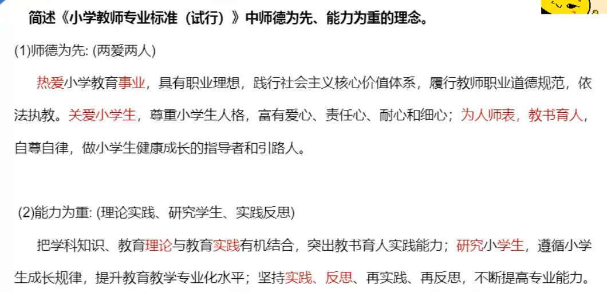

<Boxx/>
# 教育教学考试内容

## 简答题 - 注意事项

小学科目二中简答题**3 道，每道题 10 分，共 30 分**

- 按条写，有条理，顺序可变
- 言简意赅，不需要长篇论述
- 关键词和沾边词都得分
- 遇到没有背过的，不能空，条例清晰，写满

## 材料题

### 命题规律

- 1、无明确考点
- 2、有明确考点（简答一样）

### 作答规范

#### 步骤：

- 阅读题干，考查知识点
- 阅读材料，链接知识点
- 撰写成文
  - 总：理论+评价（这个老师的行为是（合理的/错误的），（符合了，遵循了，体现了/违背了）xxx 原理）
  - 分：论点+结合材料阐述
    - 分论点 1……（解释）……。材料中…… - （首先）
    - 分论点 2……（解释）……。材料中…… - （其次）
    - 分论点 3……（解释）……。材料中…… - （最后）
  - 总：照应开头，总结强化+结合自身

#### 无明确考点考试重点

- 新课改相关知识
  - 
- 教师专业发展相关知识
  - 教师劳动特点 - 创造性（教育机智=随机应变）和示范性（做榜样）
  - 教师专业发展的内容 - “心理能知道” 
    - 道德素养
    - 知识素养
    - 能力素养
    - 心理素养
  - 教师成长的途径和方法 - 微观专反（材料题第二问）
   - 微格教学
   - 观摩分析
   - 专门训练
   - 教学反思
- 教学原则
  - 科学与思想相结合
  - 理论联系实际（学以致用）
  - 直观性教学
  - 启发性教学
  - 循序渐进教学
  - 巩固性教学
  - 量力性教学
  - 因材施教
- 德育原则
  - 导向性原则
  - 疏导性原则
  - 尊重和严格要求相结合
  - 知行统一
  - 正面教育与纪律约束相结合
  - 依靠积极因素克服消极因素
  - 教育影响的一致性和连贯性
  - 因材施教
