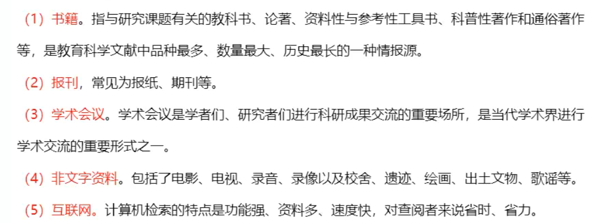
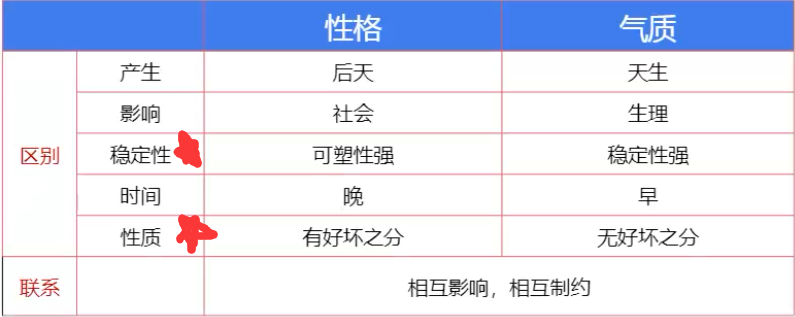
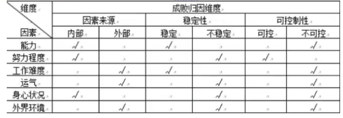
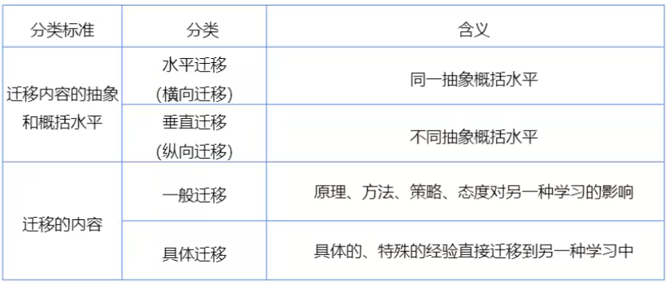
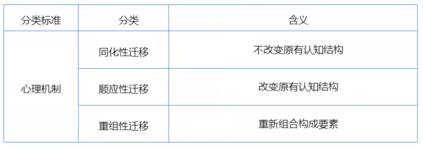
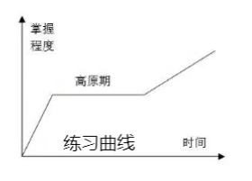

<Boxx/>
# 小学教育教学（教师资格证考试内容）

## 第一章教育基础-第一节-教育的基础知识

### 教育的生产和发展

#### 教育的内涵

- “教育” 一词的由来 --- 孟子 《孟子.尽心上》 (单选)
- 教育的概念：
  - 广义的教育：学校教育、家庭教育、社会教育
  - 狭义的教育：学校教育
- 教育的基本要素：**（★★★★★）**（单选：要素-地位-作用）
  - 教育者（主导）
  - 受教育者（主体）
  - 教育影响（桥梁）

#### 教育的属性

- 社会属性（与社会政治经济发展不平衡 - 教育可以超前（或滞后）政治经济的发展）
  - 1、永恒性
  - 2、历史性
  - 3、继承性
  - **4、相对独立性**
- 本质属性（单选）
  - 教育是**有目的培养人**的社会活动（_一定是人，且是后天学会的才能称为教育_）

#### 教育的功能（**简答**）

- 对象
  - 1、本体功能：个体发展功能
  - 2、派生功能：社会发展功能（教育通过培养人，为社会发展）
- 性质
  - 3、积极功能：正向功能
  - 4、消极功能：负向功能

#### 教育的起源

- 神话说：宗教
- 生物起源说：（教育是起源于**动物**的生存本能）（错）**（★★★★★）**
  - 利托尔诺
  - 沛.西能
- 心理起源说：（教育是儿童对成人 **“无意识的模仿”**）（错）**（★★★★★）**
  - 孟禄
- 劳动起源说：（起源于社会的生产劳动和人的发展需要）
  - 木丁斯基
  - 凯洛夫

#### 教育的发展

- 原始社会
  - 无阶级（单选）**★★★**
  - 教育和生产劳动相结合 **★★★**
  - 内容、方法简单
- 古代社会
  - 奴隶社会
    - 中国（**六艺：礼乐射御书数**）（**核心：礼乐**）
      - **夏**、商：庠、序（射箭）、校（骑马）（**夏朝：庠是中国最早的学校教育形态**）
      - 西周：政治上（嫡长子继承制），教育分国学、乡学。（政教合一，学在官府。只有士族才能学习，为了政治而学）
      - 春秋：私学兴起（学习变得学习，自由办学，自由讲学）
    - 外国
      - 古印度（《吠陀》）：家庭和寺院（宗教教育，种姓制度）
      - 古埃及（文字、书写、只能能力）：文士学校（以僧为师，以吏为师）
      - 古希腊：
        - 斯巴达：尚武
        - 雅典：崇文
  - 封建社会
    - 中国（**四书（《孟子》、《中庸》、《论语》、《大学》）五经（《诗》、《书》、《礼》、《易》、《春秋》）**）
      - 战国：私学繁荣
      - 汉代：察举制；董仲舒：罢黜百家独尊儒术
      - 魏晋南北朝：九品中正制
      - 隋唐：**科举制出现**（单选）
      - 宋元：科举制
      - 清末：**科举制废除**（单选）
    - 外国
      - 中世纪（七艺：三科、四学）：教会学校（培养纯粹信念的人）
      - 中世纪（骑士七技）：骑士学校（培养骑士）
    - 古代社会的基本特征（单选）
      - 古代产生了学校，教育成为社会专门职能
      - **教育与生产劳动相脱离**
      - **阶级性、等级性**
      - 道统性、专制型、刻板性、象征性
      - 未形成复杂的结构体系
- 近代社会
  - 国家加强了对教育的重视和干预，公立教育崛起
  - **初等义务教育普遍实施**（德国最早 ）
  - 教育的世俗化
  - 教育的法制化
- 当代教育的特点：**（可能简答）** **★★★**
  - 终身化
  - 全民化
  - 民主化
  - 多元化
  - 现代化

### 教育学及其发展

#### 教育学的萌芽阶段

##### 中国

- 《学记》：中国古代、世界上第一本教育专著 **（★★★★★）**
  - “化民成俗，其必由学”，“建国君民，教学为先” -- 教育和政治关系
  - **“道而弗牵，强尔弗抑，开而弗达”**，**“君子之教，喻也”** -- **启发式**教学
  - **“学不躐（跨越、超出）等”**，**“杂施而不孙，则坏乱而不修”**，**“不陵节而施之谓孙”** -- **循序渐进**
  - 教学相长
  - 长善救失 -- 发扬积极因素，克服消极因素
- 孔子：
  - 代表作：《论语》
  - 主张：德育为首
  - 关于教育功能：
    - 社会功能：**庶（人口）、富（经济）、教（教育）**
    - 个体功能：性相近，习相远
  - 办学方针：**有教无类**（教育平等，但是不是真正的教育公平 1）
  - 关于教学方法：
    - 学思结合
    - 因材施教
    - 启发诱导 - “不愤不启，不悱不发” --->世界上最早提出启发式教育

##### 古希腊三哲（师徒三人）

- 苏格拉底 **（★★★★★）** 师
  - 代表作 - 产婆术
  - _西方最早的启发式教育的人_
  - 对比：*世界上最早提出启发式教育*的人是：**孔子**的《学记》
- 柏拉图 徒
  - 代表作 - 《理想国》
  - 寓教于乐 - 寓学习于游戏 -> 最早提出
- 亚里士多德 **（★★★）** 徒
  - 百科全书式的哲学家
  - **首次提出** “教育遵循自然”的原则

##### 古罗马

- 昆体良 **（★★★）**
  - 代表作 - 《演说家的教育》（又称《雄辩术》）
  - 地位：**西方最早的** 教育著作。**世界上第一部研究教学法的著作**
  - 对比： 《学记》是世界上第一部研究**教育教学问题**的著作

#### 教育学创立阶段

##### 独立派 **（★★★★★）**

- 培根
  - **首次提出**“教育学”应该作为一门独立的学科
- 夸美纽斯 - **教育学之父** **（★★★★★）**
  - 代表作：**《大学教论》** 1632 年->教育学独立的标志
  - **首次**，系统的论述了**班级授课制**的方法和实施内容
  - 泛智教育 - 把广泛的自然知识传授给普通人
- 康德（赫尔巴特的老师）
  - 最早在大学讲这门课
- 赫尔巴特 **科学教育学之父 - 传统教育代表人** **（★★★★★）**
  - 代表作 - **《普通教育学》** 标志教育学进一步规范和独立
  - 原则：教育性教学原则
  - 基础：伦理学和心理学作为教育学的理论基础
  - **三中心：教师中心，教材中心，课堂之心**
  - 四阶段：明了（清除）、联想（联合）、系统和方法四个阶段
- 杜威 **进步教育代表人** 实用主义哲学创始人 **（★★★）**
  - 代表作 - 《民主主义与教育》
  - **三中心：儿童中心、经验中心、活动中心**
  - 四个即：教育即生活、教育即生长、教育即经验的改造、学校即社会、从做中学
  - 五步教学法：困难、问题、假设、验证、结论

##### 其他派

- 卢梭
  - **代表作 - 《爱弥尔》**
  - **自然培养人 、 自然后果法**
  - **最早发现了儿童**
- 洛克
  - 代表作 - 《教育漫画》
  - 提出 “白板说”
  - 提倡 “绅士教育”
- 裴斯泰洛齐
  - 慈爱的儿童之父
  - 最早提出**教育心里话主张**
- 斯宾塞
  - **科学知识**最有价值
  - 教育准备生活说

#### 教育学的发展阶段

##### 马克思主义

- 马卡连柯 **（★★★）**
  - 集体主义教育（也称：平行教育影响原则）
- 凯洛夫
  - 代表作 - 《教育学》
  - **世界上第一部马克思主义的教育著作**
- 杨贤江
  - 代表作 - 《新教育大纲》
  - 我国第一部马克思主义教育著作

##### 中国近现代教育学发展

- 蔡元培
  - 人物：北大校长
  - 观点：
    - 五育并举：军国民教育、实利主义、公民道德、世界观、美育
    - 北大改革：思想自由、兼容并包
    - 教育独立思想：经费、行政、学术、内容、**脱离宗教**
  - 称号：**学界泰斗，人世楷模** - 毛泽东
- 黄炎培
  - 人物：
  - 观点：职业教育
  - 称号：**职业教育之父**
- 陶行知
  - 人物：
  - 观点：
    - 教育实践：小庄学校、小先生制（优秀的学生教差生）、育才学校
    - 生活教育理论：**生活即教育、社会即学校、教学做合一**
    - 称号：**伟大的人民教育家** - 毛泽东、**万世师表** - 宋庆龄

##### 现代教育的发展阶段（现代教育理论）

- 赞科夫
  - 《教学与发展》
  - 发展性教学理论 - 促使所有学生得到一般发展
- 布鲁纳 **（★★★）**
  - **结构主义学习理论**（学科基本原理）
  - **发现式学习**（让学生自己探索）
- 瓦.根舍因
  - 范例教学法 - 教给学生经典案例，学生才能举一反三，提高效率
- 苏霍姆林斯基
  - 全面和谐（身心都要全面的发展）
- 布鲁姆
  - 掌握学习理论（决定学习成败的关键是**学习时间**）
  - 目标分类理论（认知、情感、动作技能）
- 巴班斯基
  - 教学过程最优化（有好的方法提高学生学习效率）

### 教育与社会发展

#### 教育和生产力

- 生产力对教育有制约作用（龟速够防守）
  - 决定教育的**规模**和**速度**
  - 制约着人才的培养**规格**和**教育结构**
  - 制约着教育内容、**方法**、组织形式和**手段**
- 教育对生产力的促进作用（两再一新促生产）
  - 劳动力再生产的基本途径 -（隐性劳动力变成现实劳动力）
  - 科学知识再生产的最有效的形式 -（高校研究）
  - 技术创新的重要手段

#### 教育和经济制度

- 政治经济制度对教育的制约作用(体内两权一目的)
  - 决定教育目的的**性质**(社会主义国家)
  - 决定教育的宗旨和**目的**
  - 决定教育的领导权(执政党:共产党)
  - 决定受教育权
  - 决定教育内容和教育管理体制
- 教育对政治经济制度的影响作用(人鱼公主促政社)
  - 培养政治**人才**
  - 促进政治**民主化**
  - **舆论**力量
  - 年轻一代的政治**社会化**

#### 教育和社会文化

- 文化对教育发展的制约作用（考过了，不再考）
- 教育对文化的促进作用（**简答题 ★★★**）
  - 传递和保存文化
  - 传播和交流文化
  - 选择和提升文化（取精去粕）
  - 更新和创造文化
- 学校文化
  - 物质文化
  - **精神文化 --- 核心 （★★★）**
  - 制度文化

### 教育的目的

#### 教育目的的概念

- 教育目的是国家对培养人的总的要求
- 地位：（**单选**）
  - 教育目的是教育工作的**出发点和归宿**，对教育工作具有**全程性**的指导作用，是整个教育工作的**方向**

#### 确立教育目的的有关理论（单选）

- 社会本位论
  - **教育目的以社会需要为核心**
  - **_赫尔巴特、柏拉图、孔德、涂尔干、凯兴斯泰纳_**
- 个人本位论
  - **教育目的以个人需要为核心**
  - **卢梭、罗杰斯、福禄贝尔、裴斯泰洛齐**

#### 确立我国的教育目的的依据 **（简答 ★★★）**

- 特定的社会政治、经济、文化背景
- 受教育者的身心发展规律
- 制定者的教育思想
- 理论基础 - 马克思关于人的全面发展学说（**单选**）

### 教育制度

#### 学校教育制度在形式上的发展 （单选）

- 前制度化（没有严格的制度化）- **实体化教育（出现了教育实体）** - 开始于原始社会，一直到奴隶社会时期
- 制度化教育（有严格的制度化）- **正规教育** - 兴起于清朝末年（1905 年，废除科举，兴建学堂）
- 非制度化（超越了现有的教育制度）- **学习型社会** - 活到老学到老，终身教育，书香型社会

目前中国处于**制度化教育阶段**

#### 影响教育制度的因素 **（简答 ★★★）**

- 生产力发展水平
- 政治经济制度
- 科技发展水平
- 青少年身心发展规律
- 民族文化传统和外国学制的影响

#### 现代学制类型（双欧单美分苏联）

- 双轨制（有钱人学知识，穷人学技能） - 欧洲 - _不利于普及教育，也不利于教育公平_
- 单轨制（所有人接收一样的教育资源） - 美国 - _有利于普及教育，促进教育公平。但是并不是所有人学习能力都一样，所有出现我想学习技能出来打工却没办法实现_
- 分支制（小学初中所有人都一样学习基础知识，高中开始读书好的继续专研，习惯学习技能的上了技校） - 苏联（我国）- 我国是从单轨制到分支型学制

#### 我国现在学制发展 （**单选**）

- 壬寅学制（**首次颁布**，但是没有实施）- 参考日本
- 葵卯学制（首次实施）- 中学为体，西学为用- **★★★**
- 壬子葵丑学制（资本主义性质，第一次规定男女同校）- 蔡元培修改的 - **★★★**
- 壬戌学制（也称作“新学制”或“1922 学制”或“633 制度”，小学 6 年，初中 3 年，高中 3 年）- 参考美国 - 长期使用，知道新中国成立第二年，1951 年更改新中国第一个学制

#### 义务教育制度（9 年）

- 概念：适龄儿童必须接受国家、社会、学校、家庭必须予以保障的国家教育
- 特点：（**1986 年颁布** - **2006 年修改**）
  - **强制性**
  - **普及性**
  - **免费性**（学杂费）
  - 公共性（缩小各个地区的教育资源差距）- 均衡发展
  - 基础性（小学 6 年，初中 3 年）

## 第一章教育基础-第二节-教育的研究方法

### 教师专业发展

#### 教师概述

- 含义：教师是履行教学职责的**专业人员**，承担**教书育人**（根本任务，主要任务，天职 -- 单选题）、培养社会专业建设人才，提高民族素质的实名
- 教师的职业角色 --- **多样化** -> 单选
  - 传道者；授业解惑者；示范者（学生有向师性，所以教师要做好榜样）；设计者……

#### 教师劳动特点 （单选）（简答）**★★★★★**

- 复杂性（**多，杂**）和创造性（**因材施教，教育方法要实时更新，教育机智：面对突发情况可以随机应变**）
- 连续性（**时间上的连续，教师没有明确的上下班时间**）和广延性（**空间上觉有广延性，路过可能就去家访了**）
- 长期性（**人才培养的时间比较长，所以教育影响具有滞后性-->指学习之后某个时间内才发现学习的用处**）和间接性（**并不是直接促进社会发展，而是通过培养人才**）
- 主体性（**教师自身可以成为课程资源**）和示范性（**老师要做好榜样**）
- 个体性（**劳动方式的个体性，比如某某老师的讲课方式，就是他的个体性**）和群体性（**所有人对你的影响，如所有的老师教你，让你德智体美劳都得到发展，就是成果的群体性**）

#### 教师专业发展的内容 **材料题 ★★★★★**

- 道德素养：科目一的内容。。
- 知识素养 **★★★★★**
  - 政治理论修养
  - **学科专业修养（本体知识：数学是数学老师的学科专业修养）**
  - 科学文化修养（天文地理，非本体的知识都算）
  - **教育科学修养（教育学，心理学）**
- 能力素养 **★★★★★**
  - 语言表达
  - 教育教学
  - 组织管理（组织课堂）
  - **自我调控（自我反思的能力：教育机智的问题）**
- 心里素养
  - 心里健康

#### 教师专业发展阶段（单选）

- 关注生存 （**新人教师**）- 人际关系
- 关注情景 - 学习成绩和课堂效率
- 关注学生（**成熟的标志**） - 学生的个别差异性（**单选**）

#### 教师成长的途径和方法（微观专反）**简答** **★★★★★**

- 观摩和分析优秀教师的教学活动
- 开展微格教学（录制视频，并反思）
- 进行专门的训练
- 反思教学经验 - （经验+反思=成长 ->**单选**）

#### 《小学教师专业标准（试行）》 **简答** **★★★★★**

- 基本理念
  - 师德为先：（两爱两人）
    - 热爱事业
    - 关爱学生
    - 为人师表
    - 教书育人
  - 能力为重
    - 理论实践能力
    - 研究学生能力
    - 实践反思能力

- 基本内容
  - 专业理念与师德：（4 对：对学生，对职业，对教育，对个人）
    - 职业理解与认识
    - 对小学生的态度和行为
    - 教育教学的态度和行为
    - 个人修养和行为
  - 专业知识（考过了）
  - 专业能力（考过了）

- 拓展：教师期望对学生的影响
  - **罗森塔尔效应**，也成**皮格马利翁效应**或教师**期望效应**
  - 罗森塔尔效应认为教师的期望或明或暗的被传送给学生，学生会按照教师所期望的方向来塑造自己的行为

#### 良好师生关系建立的途径和方法 **材料分析**

- 教师方面
  - 了解和研究学生
  - 树立正确的学生观
  - 提高自身素质
  - 发扬教育民主
  - 热爱、尊重学生，公平对待学生
  - 主动、善于和学生沟通
  - 正确处理师生矛盾
  - 提高法治意识，保护学生的合法权利
- 学生方面
  - 正确认识自己
  - 正确认识教师
- 环境方面
  - 加强校园文化建设
  - 加强学风教育

### 教育研究方法 （**简答，单选都考**）

#### 小学教育科研的**概念**

- 以**小学教育的特点和规律**作为研究对象，运用**科学的理论和方法**，探索小学教育领域的**客观规律**的一种特殊的认识和实践活动

#### 教育研究的一般过程（**简答**）

- 确定研究课题
- 查阅文献
- 提出研究假设
- 制定计划、方案
- 收集、整理和分析资料
- 得出结论
- 撰写成文

#### 文献的分类（单选）

- 一次文献（**原始文献**）
  - 专著、论文、调查报告和档案材料
- 二次文件（**检索性文献**）
  - 目录、索引、提要、摘文
- 三次文献（**参考性文献**）
  - 动态综述、专题述评、进展报告、数据手册、年度百科全书和专题报告

#### 文献的来源 （**简答**）（单选 - 一般考书籍地位）

- 书籍 - 品种最多、数量最大、历史最长
- 报刊
- 学术会议
- 非文字资料
- 互联网

#### 常用的教育研究方法（**简答**）（单选）

- **观察法**（地位：使用**最广**，**最基本**的研究方法）
  - 直接观察 和 间接观察 （看有没有借助仪器）
  - 结构性观察 和 非结构性观察 （看有没有计划性）
  - **参与观察：参与者 和 非参与观察：旁观者 （是否直接参与活动）**
  - 自然观察 和 控制观察：也称为实验室观察 （是否控制条件）
  - 时间取样观察 和 事件取样观察 （取样方法不同）
  - **系统观察 和 非系统观察 （活动是否有规律）**
  - 观察法的实施步骤（**简答**）
    - 前：1、训练观察人员 2、获准进入现场
    - 中：3、实施观察（**核心**） 4、做好观察记录
    - 后：5、资料的整理分析
- 问卷法
  - 实施步骤：回收率大于 70%才算有效
  - 1、问卷的编制
  - 2、问卷的测试
  - 3、问卷的发放
  - 4、问卷的回收
- 访谈法 （考过）
- 教育实验法 （考过）
  - 类型：
    - 实验室试验
    - 自然试验/现场试验
  - 基本要素
    - 自变量（引起改变的原因）
    - 因变量（引起改变的结果）
    - 无关变量（干扰因素）
- 教育叙事研究（描述事实|讲故事）
- **教育行动研究** ：从行动中来到行动中去
  - 确立课题
  - 查阅文献
  - 拟定行动计划
  - 实施行动
  - 总结反思
  - 评价效果
- 个案法（单选）
- 比较研究法（单选）
- 经验研究法（单选）
- 历史法（单选）
- 作品分析法（单选）

#### 教育科研的成果

- 内容 （**简答**）
  - 成果的喜悦
  - 失败的教训
  - 教学中的闪光点
  - 教学机智
- 特征（**简答**）
  - 随手、随便、随心
  - 短小精悍
  - 迅速及时
  - 取材广泛

## 第一章教育基础-第三节-心理学基础知识

### 心理学的研究对象及其结构

#### 冯特 - **心理学之父** 1879 年实验室心理学（单选）

#### 注意

- 注意：是指心理活动或者意识对一定对象的**指向**和**集中**
- 功能：（单选）
  - 选择功能（选取一个对象）
  - 保持功能（一直维持）
  - 调节和监督功能（调节注意活动）

#### 注意种类（心理学的随意指的是跟随意志努力）

- 无意注意（不随意注意）
  - 无目的
  - 不需要意志努力
- 有意注意（随意注意）
  - 有目的
  - 需要意志努力
- 有意后注意（随意后注意）
  - 有目的
  - 不需要意志努力

#### 注意的品质

- 注意的范围（也称为注意的广度。数目的多少：一目十行）
- 注意的稳定性：无意识，被动的（又称作注意的分散、分心。注意时间的长短，越长稳定性越好）
- 注意的分配（一边……一边……）
- 注意的转移：有意识，主动的（有意识的由 A 到 B）

#### 小学儿童注意的培养 （**材料和简答**）

- 要善于运用无意注意的规律
- 善于组织和发展学生的有意注意
- 善于运用两种注意相互转换的规律
- 避免与控制分心

### 感觉

感觉是直接作用于感觉器官的客观事物的个别属性，在人脑的反应

#### 种类

- 外部感觉
- 内部感觉

#### 感觉的一般规律 （单选）

- 反比（**感受性和感觉阈值成反比**）
  - 感受性（能力）- 敏感性
  - 感觉阈限 （数值）

### 知觉

知觉是人脑对于直接作用于感觉器官的事物的**整体属性**的反应

#### 知觉的种类

- 空间知觉
- 时间知觉
- 运动知觉

#### 知觉的基本特性

- 选择性（对象与背景）- 多个选一个（选到的叫做对象，没选到的叫做背景）
- 整体性（部分与整体）
- 理解性（已有经验）- （由于知识经验不同，所以对同一个东西的理解不同）
- 恒常性（条件与本身）- （条件变化，但是对象不变，如不管什么时候，五星红旗的背景都是红色的）

### 记忆

#### 分类

- 内容与经验对象
  - 形象记忆（图像、声音）
  - 逻辑记忆（公式、定理）
  - 情绪记忆（情绪）
  - 动作记忆（跑跳运动）
- 保持时间
  - 瞬时记忆（小于一秒，容量较大）
  - 短时记忆（小于一分钟，工作记忆，7±2 组块）-> 容易受到干扰
  - 长时记忆（大于一分钟，容量无限）

#### 记忆的遗忘

- 记忆的痕迹衰退说 --- **不复习**
- 干扰抑制说
  - 前摄抑制 （前 -> 后 干扰）
  - 倒摄抑制 （后 -> 前 干扰）
- 动机说 --- **紧张、压抑**
- 提取失败说 --- **缺线索、线索错误**
- 同化说 --- **高级代替低级**

#### 回忆和再认

- 再认 （再次出现，选出来正确的） - 如做选择题
- 回忆 （不出现，只在脑子里呈现） - 如做简答题

#### 良好记忆品质的特点

- 敏捷性（速度快：过目成诵）
- 持久性（时间长：终身不忘）
- 准确性（精确：倒背如流）
- 准备性（提取：出口成章）

#### 提高记忆能力的方法（**简答**）

- 明确记忆目的，增强学习主动性
- 理解材料的意义，少用机械记忆
- 对材料进行精细加工，促进深度理解
- 运用组块化学习策略，合理组织材料
- 运用多重编码，提高信息加工处理的质量
- 注重复习方法，防止知识遗忘

### 思维

**思维**是借助语言、表现或者动作实现的，对客观现实**间接的，概括的**反应

#### 思维的类型

- 发展水平划分
  - 直观动作思维
  - 具体形象思维
  - 抽象逻辑思维
- 逻辑性划分
  - 直觉思维 - **突然、立即**
  - 分析思维 - **逐步分析**
- 指向性划分
  - 聚合思维 - **一题一解**
  - 发散思维 - **一题多解**
- 创造程度划分
  - 再造性思维（**常规性思维**）- 运用公式解题
  - **创造性思维**（**单选**）
    - 流畅性（数量多）
    - 变通性（灵活性，类型多）- 触类旁通
    - 独创性（独一无二）

#### 创造性的培养（**材料分析、简答**）

- 创设有利于创造性产生的**适宜环境**
- 注重创造性**个性的塑造**
- 开设培养创造性的**课程**，进行创造性思维的训练（头脑风暴，集体讨论，脑激励法）

### 想象

想象是人脑对已储存的表象进行加工改造，形成新形象的心里过程

#### 想象的分类（**单选**）

- 有意想象：有目的性，需要意志努力
  - 再造想象：根据言语描述，或图形示意再次想象出来
  - 创造想象：（从无到有的过程）
    - 幻想
      - 理想（和实际相连）
      - 空想（和实际不符）
- 无意想象：没有预先目的，不由自主产生的想象

#### 培养学生想象力的方法（**简答**）

- 学会观察
- 积极思考
- 努力学习
- 学科教学，训练想象力
- 积极的幻想（结合实际）

### 情绪过程

情绪一般指个体在其**需要是否得到满足**的情境中直接产生的心里体验和相应的反应

#### 情绪的分类（**单选**） --- 一般会考古诗

- 心境（心情） - 弥散性，长期性（感时花溅泪，恨别鸟惊心）
- 激情 - 爆发性，冲动型，短暂的，强烈的（彩票中一千万，暴跳如雷，悲痛欲绝）
- 应激 - 意外情况（急刹车）

#### 情感过程 （**单选**）

情感一般指个体意识到自己与客观事物的关系后而产生的**稳定的，深刻的**心里体验和相应的反应

- 道德感（道德活动中）
- 理智感（智力活动中，维护真理）- 求知欲，好奇心得到了满足，就是理智感
- 美感（审美活动中）

#### 情绪情感的关系

|      |      | 情绪               | 情感       |
| ---- | ---- | ------------------ | ---------- |
| 区别 | 需要 | 自然需要           | 社会需要   |
|      | 主体 | 人+动物            | 人         |
|      | 时间 | 早                 | 晚         |
|      | 特点 | 情境、动摇         | 稳定、深刻 |
|      |      | 外显、冲动         | 内隐、持久 |
| 联系 |      | 相互影响、相互制约 |            |

### 意志

意志是有目的的，有意识地支配自己的行动个，**克服困难**，从而实现预定目标的心里过程

#### 意志行动的准备阶段

- 准备阶段（**单选**）
  - 动机斗争
    - **双趋**冲突：两喜择一
    - **双避**冲突：两避择一
    - **趋避**冲突：同一目标，好恶俱存
    - **多重趋避**冲突：N 个既趋又避，N 选一
- 确定目标
- 选择行动方法和制定行动计划

### 更性心理

#### 个性倾向性 --- 需求

- 成长性需求
  - 自我（**最高层次**）
  - 审美需求
  - 认知需求
- 缺失性需求
  - 尊重的需求
  - 归属与爱的需求
  - 安全需求
  - 生理需求（**最低层次**）

#### 个性心理特征

能力：直接影响活动效率，促使活动顺利完成的个性心理特征

- 构造不同
  - 一般能力
  - 特殊能力

#### 卡特尔 - 智力形态论

|          | 来源     | 发展趋势 |
| -------- | -------- | -------- |
| 晶体智力 | 后天学习 | 上升     |
| 流体智力 | 先天遗传 | 先升后降 |

#### 多元智力理论 （**单选**）

加德纳的《多元智力理论》，是新课改的基础内容之一

- 言语智力
- 逻辑数学智力
- 空间智力
- 音乐智力
- 运动智力
- 人际智力
- 自知智力
- 自然智力

#### 智力测验

| 名称              | 观点                                         | 代表人物     | 地位                               |
| ----------------- | -------------------------------------------- | ------------ | ---------------------------------- |
| **比纳-西蒙量表** |                                              | 比纳.西蒙    | **世界上第一个标准化智力测验量表** |
| 斯坦福-比纳量表   | **IQ = (MA（智力年龄）/CA（实际年龄）)x100** | 推孟（修订） | 世界上最著名的智力量表             |
| 韦克斯勒智力量表  |                                              | 韦克斯勒     | 世界上第一个分段智力量表           |

#### 影响能力发展的因素 （**简答**）

- 先天素质
- 早期经验
- 教育和教学
- 社会实践
- 主观努力

### 人格

**性格（核心）** + 气质 + 自我调控 = 人格

#### 个性心理特征

弗洛伊德的人格**三我结构**

- 本我 - 快乐（只考虑自己的快乐）
- 自我 - 现实（考虑到现实）
- 超我 - 道德（考虑到现实）

#### 性格的结构特征

- 态度特征（**核心**）
- 意志特征
- 情绪特征
- 理智特征

#### 良好性格的培养（**简答**）

- 三观教育
- 强化行为
- 榜样示范
- 集体教育
- 因材施教
- 自我教育

### 气质

气质是心理活动表现在强度，速度，稳定性和灵活性等方面的心里特征

#### 气质的分类

#### 气质与性格的关系

### 自我调控系统

- 自我认知（自我认识）
- 自我体验（情绪情感上的）
- 自我控制（行为上的）

#### 自我调控系统的发展

- 1-3 岁 （生理自我：关注身体结构）
- 3 岁-少年期（6-7 岁到 11-12 岁） （社会自我：关注人际关系和社会地位）
- 青春期之后 （心理自我：性格和兴趣）

### 社会心理

#### 自我防御机制

- 升华 （不认可到认可，不接受到）
- 补偿（不足到弥补：笨鸟先飞）
- 转移或移置（以大欺小：踢猫效应）
- 共情（同理心：换位思考）
- 移情（学生对老师）
- 反移情（老师对学生）

#### 印象形成效应（**单选**）

- 刻板效应（一群人->一个人：四川人，吃辣）
- 晕轮效应（光圈、光环效应；一好百好）
- 首因效应（第一印象，最初效应）
- 近因效应（最近效应）
- 投影效应（以己度人）

## 第一章教育基础-第四节-基础教育课程改革

### 基础教育改革

- **广义的课程**是指实现学校教育目的而选择的**教育内容的总和及进程安排**；
- **狭义的课程**是指某一门学科

#### 课程的类型

- 内容属性
  - 学科课程（某一门学科，间接经验为主）
  - 活动课程（学生兴趣，直接经验为主）
- 组织方式
  - 分科课程
  - 综合课程
- 实施要求
  - 必修课程 （必须的，共性的）
  - 选修课程（选择学个性）
- 设计开发主体（**重点**）
  - 国家课程（国家教育部规定：马基，毛概，思修）
  - 地方课程（省教育部门开发）
  - 校本课程（主要由老师开发；目的是学校办学）
- 课程任务
  - 基础性课程（读写算）
  - 拓展性课程（开阔视野）
  - 研究性课程（培养孩子的探究能力）
- 课程呈现方式
  - 显性课程（计划之内的，老师专门讲的）
  - 隐性课程（内隐的，潜移默化的影响课程，班风，校风之类的；统称计划之外的）
- 课程的层次（**古德莱德课程层次理论**）
  - 理想的（研究机构，专家）
  - 正式的（教育执行部门）
  - 领悟的（任课老师的领悟）
  - 运作的（教师实际的实施）
  - 经验的（学生实际的体验）

#### 课程内容（课程的文本表现形式或课程设计的三个层次）

**上是下的依据，下是上的具体化**
**加粗的都是单选重点**

- 课程计划
  - 概念：**教育教学**的指导文件
  - 构成：培养目标、**教学科目的设置（核心）**、学科顺序、课时分配、学年编制和学周安排
  - 地位：课程设置的**整体规划，全面安排**
- 课程标准（**核心：课程目标**）
  - 概念：某门**学科**的指导性文件
  - 构成：前言、课程目标（**核心**）、内容标准。实施建议、附录。
  - 地位：**教材编写、教学、评价和考试命题的依据**
- 教材
  - 概念：教学活动的**材料**
  - **主体**：教材->教科书（课本）和讲义
  - **编排方式**：1、纵向组织（知识难度越来越深）和横向组织（同一水平的知识）；2、直线式（不重复）；螺旋式（重复）

#### 简述课程内容的三种文本表现形式（**简答**）

- 课程计划：是国家教育主管部门制定的有关学校教育教学的指导性文件
- 课程标准：是课程计划的分科展开
- 教材：是教师和学生据以进行教学活动的材料

#### 课程资源

- 来源
  - 校内课程资源
  - 校外课程资源
- 存在方式
  - 显性课程资源
  - 隐性课程资源
- 功能特点
  - 素材性课程资源
  - 条件性课程资源
- 性质
  - 自然课程资源
  - 社会课程资源

#### 课程开发 （影响课程开发：社会（学科）、知识、儿童（学生））

- 目标模式（泰勒：现代课程理论之父）
  - 确定目标
  - 选择经验
  - 组织经验
  - 评价计划

#### 课程实施的基本取向（**单选**）

- 忠实取向：忠实执行课程计划（按计划走）
- 相互调试取向：计划与实际的双向互动与改变
- 缔造取向（创生）：教师开发缔造新的经验（即兴发挥）

#### 课程评价

- 目标评价模式
  - 泰勒
  - 关注计划、预期
- 目的游离评价模式（**重点（单选）**）
  - 斯克里文
  - 预期和实际都要关注

### 基础教育课程改革

**核心理念**：“以人为本”--一切为了每一位学生的发展

#### 基础教育课程改革的目标（**简答**）

- 课程功能的转变
  - 双基（基础知识，基本技能）变成三维目标观（知识与技能，过程与方法，情感态度和价值观）
- 课程结构观
  - 均衡性（课程比例）
  - 综合性（综合课程）
  - 选择性（学校自主权）
- 内容联系观
  - 与社会生活
  - 学生经验联系
- 学习方式观
  - 合作（小组分工）
  - 自助（自觉主动）
  - 探究（发现分析）
- 发展评价观
  - 重视学习**过程**的评价（发展性评价）
- 课程管理观（三级管理）
  - 国家
  - 地方
  - 学校

#### 新课程改革的课程结构 (**单选**)

- 整体设置**九年一贯**的义务教育课程
  - **小学 - 综合课程**
  - **初中 - 分科和综合相结合**
  - **高中 - 分科课程**
- 小学到高中设置**综合实践活动课程**并且作为**必修课**，内容包括
  - 信息技术学习
  - 研究性学习
  - 社区服务与社会实践
  - 劳动与技术教育
- 农村中学课程要为当地社会经济发展服务

### 新课改的教育观

### 新课改的评价观

#### 发展性评价的基本内涵(**简答**)

- 评价的根本目的在于促进发展
- 体现最新的教育观念和课程评价发展的趋势
- 评价内容综合化
- 评价标准分层化
- 评价方法多样化
- 评价主体多元化
- 关注发展过程

## 第二章-学生指导

### 第二章学生指导-第一节 - 小学生身心发展的规律

#### 个体身心发展的概念

个体的身心发展指：**生理**和**心理**两个方面的发展

#### 个体身心发展的动因（**单选**）

| 内发论                                                                 | 外铄论                                                   |
| ---------------------------------------------------------------------- | -------------------------------------------------------- |
| **孟子、弗洛伊德、威尔逊**、**格赛尔（双生子爬梯实验）**、霍尔、高尔登 | **荀子、洛克、花生**(就这三个是外铄论，其余的都是内发论) |

#### 影响人身心发展的因素

- 遗传 - 物质前提、可能性
- 环境 - 可能性变现实
- **个体主观能动性** - **决定性因素、动力**
- 学校教育 - **主导** 具有**延迟作用**

#### 个体身心发展的一般规律

- 顺序性 - **循序渐进**（不可逆，不可跨越，从什么到什么）
- 阶段性 - **分阶段教学**、针对性（强调不同阶段的特征、矛盾、任务）
- 不平衡性 - 抓**关键期**、适时而教（速度有快有慢）
- 互补性 - **扬长避短、长善救失**（身身互补 - 盲人耳聪、身心互补 - 身残志坚）
- 个别差异性 - **因材施教**（教育启示）；表现不一样

| 规律     | 顺序性         | 阶段性                 | 不平衡性     | 互补性             | 差异性       |
| -------- | -------------- | ---------------------- | ------------ | ------------------ | ------------ |
| 特点     | **方向不可逆** | **不同阶段**，不同特点 | 速度有慢有快 | 身身互补，身心互补 | 人与人有不同 |
| 教育启示 | **循序渐进**   | 有针对性               | 速度有慢有快 | 身身互补，身心互补 | 人与人有不同 |

### 第二章学生指导-第二节 - 小学生的学习

- 学习的内涵（**单选**）
  - **个体（人、动物都可以学习，但是只有人有教育）**在特定的情景下由于**经验和反复练习（本能、药物引起的改变都不是学习）**而产生的**行为或行为潜能**的比较**持久**的改变
- 学习的分类
  |分类标准|具体内容|
  | ------------ | ------------------ |
  |**学习结果（加涅）**|（**单选**）语言信息（是什么：陈述东西）、智慧技能（怎么做：脑子去想这个东西）、认知策略（怎么学习，学习策略）、态度、动作技能（学习动作本身，如学习跳舞）|
  |**学习性质与形式（奥苏贝尔）**|学习进行方式：接收学习、发现学习；学习材料与学习者原有知识关系：机械学习、意义学习（理解学习）|
  |学习内容|知识学习、技能学习、道德品质和行为习惯学习|
- 学习理论 （**重点（）**）
  - 行为主义
    - 基本观点：形成**刺激（S）**与**反应（R）**的联系（**S-R**）
    - 巴甫洛夫的经典性条件作用理论（狗进食摇铃试验）（**单选**）
      - 无条件反射 - 本能
      - 条件反射 - 后天学习
      - 第一信号：客观实物（实实在在存在）
      - 第二信号：语言，符号（谈虎色变，画饼充饥）
      - 条件反射的基本规律
        - 刺激的泛化：相同反应（分不清：**银行** 看成 **很行**）
        - 刺激的分化：不同反应（分得清楚）
    - 桑代克 - 尝试错误说（饿猫开笼取食）
      - 盲目尝试 - 逐步减少错误 - 再尝试
      - 学习定律
        - 准备率（预习）
        - 练习律（做题：巩固学习）（做一些有代表性的题目，而非题海战术）
        - 效果律（反馈）（**最重要**）
    - 斯金纳的操作性条件作用理论
      - 操作性条件的基本规律（**重点选择**）
        - **正强化：愉快：要看对象快不快乐。如：表扬，奖励**
        - **负强化：厌恶。如：取消处分**
        - **惩罚：厌恶。如：体罚，谴责**
        - **消退：无。如：不予理睬**
    - 班杜拉观察学习理论
      - 观察学习（模仿别人）
        | |A 组|B 组|C 组|
        |--|--|--|--|
        |TV|观看：攻击得到奖励|攻击得到惩罚|攻击什么都没有|
        ||强烈攻击欲望|没有攻击欲望||
      - 班杜拉三种强化（**重点单选**）
        - 直接强化（你考 100 分我奖励你 100 块）
        - 替代性强化（你看到别人考 100 分得到奖励，你也努力考 100 分，也想要奖励）（**重点**）
        - 自我强化（你规定自己考 100 分，然后奖励自己花 100 块）
  - 认知主义（学习是主动在**头脑内部**构建认知结构）
    - 苛勒完形 - 顿悟说
      - 黑猩猩取香蕉试验（得到观点：学习是通过顿悟过程实现的，学习的实质是在于构造完形）
    - 布鲁纳认知 - 发现说
      - 一个实质：**主动形成认知结构**
      - 两个核心：
        - 学什么：学科基本结构
        - 怎么学：**发现学习**
    - 奥苏贝尔的有意义接受学习
      - 有意义的学习实质条件
        - 实质：新知识和已有知识建立起**非人为（内在的）**的和**实质性（非字面）**的联系
        - 条件：
          - 学习材料的逻辑意义
          - 有意义学习的心向
          - 学习者认知结构中必须具有适当的知识，以便与新知识进行联系
      - 先行者组织（不是一个人）
        - **先于**学习任务本身呈现的一种**引导性材料**，它比学习任务本身有**较高的抽象**，概括和综合水平，并且可以清晰地的与认知结构中原有观念和新任务关联起来
    - 皮亚杰认知发展阶段论（**重点**）
      - 四个名词
        - 图式：认知结构（一种结构）
        - 同化：**认知不变**
        - 顺应：**认知改变**
        - 平衡：状态、动态的
      - 认知发展理论（**加粗为单选**）
        - 感知运动（0-2）
        - 前运算（2-7）- **1、一切以自我为中心(我喜欢的你一定也喜欢) 2、思维具有不可逆性**3、刻板性 4、万物有灵论**5、没有守恒概念**
        - 具体运算（7-11）（和前运算完全相反）- **1、守恒观念形成（这个阶段的标志**）**2、思维运算必须有具体的事物支持，可以进行简单的思维抽象**3、思维具有可逆性 4、理解原则和规则，但只能刻板遵守，不敢改变
        - 形式运算（11-16）- 1、逻辑推理、归纳或者演绎 2、能理解符号意义，能做一定的概括 3、思维接近成人
    - 维果斯基的理论
      - 最近发展区：指两种水平之间的差距（当前的发展水平 - 学生独立完成任务 和 潜在的发展水平 - 学生在帮助下完成任务）：给出启示：教学要走在发展的前面
  - 重构主义（**简答题**）基于自己的经验去理解，建构知识
    - 知识观
      - 解释假设（动态性）
      - 情境性
      - 经验背景建构（主观性）
    - 学生观
      - 丰富性
      - 差异性
    - 学生观（新课改的理论知识之一）
      - 主动构建性
      - 社会互动性
      - 学习情境性
  - 人本主义
    - 马斯洛自我实现的人格观
    - 罗杰斯的学习理论**（单选）**
      - 学生中心教学观：学生中心模式又称为**非指导模式**，教师的角色是“助产士”或“催化剂”
- 个体差异

  - 智力差异
    - 智力水平：正态分布（中间高两边低 - 正常人多，弱智和非常聪明的少）
    - 智力类型
    - 能力表现早晚：聪明早慧、大器晚成
    - 性别差异 -- 总体水平大致相等、离散程度男性大于女性；优势领域有区分
  - 认知方式差异（没有好坏之分）

    - 场独立型和场依存型 - 内部（有主见） VS 外部（看别人脸上行事）

      - |          | 场独立型           | 场依存型            |
        | -------- | ------------------ | ------------------- |
        | 学科兴趣 | 科学、教学（理科） | 人文、社会 （文科） |
        | 学科成绩 | 科学、教学（理科） | 人文、社会 （文科） |
        | 学习策略 | 自主学习；内部动机 | 合作学习；外部动机  |
        | 教学偏好 | 不严谨             | 严禁                |

    - 沉思型和冲动型 - 精度&速度
    - 辐合型和发散型 - 由多到一 VS 由一到多

- 埃里克森的社会化发展理论
  - 社会
    - 信任对不信任（0-1.5 岁）- 建立信任感，克服怀疑
    - 自主对羞怯与怀疑（1.5 岁-3 岁）- 建立自主感（自己的事情自己做），克服羞怯
    - 主动感对内疚感（3-6/7 岁）- 建立主动感（帮别人做事），克服内疚
    - **勤奋对自备**（6-12 岁）- 建立勤奋感，克服自备（要正确的归因，努力程度）
  - 发展
    - **角色统一对角色混乱**（12-18 岁）- 建立角色统一，克服混乱
    - 亲密对孤独（18-30 岁）- 建立亲密感，克服孤独
    - 繁殖对停滞（30-60 岁）- 建立繁殖感，克服停滞
    - 完善对绝望（60 岁以后）- 建立完善感，克服绝望
- 学习兴趣的激发和培养（**简答**）
  - 建立积极心里准备
  - 利用学科优势
  - 创设问题情境
  - 在一、二课堂培养
  - 改进教学方法
- 良好学习习惯的培养
  - 培养小学生良好学习习惯的策略
    - 发挥**课堂主渠道作用**，培养学生良好的学习习惯
    - 课堂中**正确引导**
    - 注重激励和表扬，对学生进行**正强化教育**
    - **开展丰富多彩的活动**，在活动中培养学生良好的学习习惯
    - **发挥家长作用**，形成家校合作
    - 分层渐进，注重对学生进行**个别辅导**
    - 建立小学生良好学习习惯**评价体系**

### 第二章学生指导-第三节 - 小学生德育

#### 道德发展阶段理论

- 皮亚杰（**单选、简答**）
  - 方法：对偶故事法
  - 儿童道德发展阶段（**10 岁是分水岭 - 单选**）
    |阶段名称|年龄|道的特点|
    |--|--|--|
    |前道德（自我中心）|2-5|无道德|
    |他律道德（权威）|5-8|服从外部规则，重行为结果|
    |自律道德（可逆性）|9-11|有自己的意识，重行为动机|
    |公正道德|11 岁以后|公道、公正符合个人|
- 科尔伯格
  - 方法：道德两难故事法（**单选、简答**）
  - **三水平六阶段**
    |三水平|六阶段(每个习俗两个阶段)|含义|
    |--|--|--|
    |前习俗（9 岁以下）|1.惩罚和服从、2.相对功利|1.避免惩罚、2.符合自己的利益|
    |**习俗水平（9-16 岁）**|1.寻求认可（好孩子）、2.维护秩序（法律秩序，规章制度）|1.符合大家的意见、2.尊重法律，法律不可变|
    |后习俗（16 岁以后）|1.社会契约、2.普遍原则|1.法律可变、2.道义（生命）高于一切|

#### 小学生品德发展的特点

- 儿童道德发展的关键年龄（三年级）

#### 德育过程的基本规律（**单选**）

- 德育过程是促使学生**知、情、意、行**互动发展的过程
  - 知是**基础（核心）**；情是**内部动力（催化剂）**；意是**精神力量**；行事衡量一个人品德水平的**重要标志**
- 德育过程是组织学生的**活动和交往**，统一多方面教育影响的过程
- 德育过程是促使学生思想品德**内部矛盾**积极转化的过程
- 德育过程是一个**长期、反复、逐步提高**的过程

#### 德育原则（**重点，材料/选择都会考**）

- 导向性原则（政治方向）
- 疏导性原则（循循善诱，以理服人）
- 尊重与严格要求相结合（严慈相济）
- 知行统一原则（认识+行为）
- 正面教育与纪律约束相结合（正面例子+纪律约束）
- 依靠积极因素，克服消极因素（长善救失）
- 教育影响的一致性和连贯性（家校社）
- 因材施教

#### 德育的途径和方法（**重点单选**）

- 说服教育法（摆事实、讲道理）- 最基本的
- 榜样示范法（模范行为）
- 情感陶冶法（潜移默化）
- 实际锻炼法（参加活动）
- 品德评价法（奖励、惩罚、评价和操行评定）
- 道德修养法（自我反省）
- #### 德育模式
- 小学生的品德指导（**简答、材料分析**）
  - 客观原因
    - 家庭
    - 学校
    - 社会
  - 主观原因
    - 认识（知）
    - 情感（情）
    - 意志（意）
    - 行为（行）
    - 性格

### 第二章学生指导-第四节 - 小学生安全与心理健康教育（**单选**）

#### 小学生营养卫生（**必考单选**）

- 缺少维生素 A
  - 夜盲症
- 缺少维生素 B1
  - 消化不良、厌食、呕吐
- 缺少维生素 B2
  - 口角溃烂、口角炎、角膜炎
- 缺少维生素 C
  - 骨质疏松、牙床出血、易患感冒
- 缺少维生素 D
  - 佝偻病、软骨病、头部多汗
- 缺少维生素 E
  - 肌肉萎缩、头皮发干、头发分叉

#### 小学生常见疾病及意外事故（**必考单选**）

- 中暑
  - 第一步：降温，搬到阴凉的地方
- 溺水
  - 清除嘴里脏东西、清淤
- 电击
  - 切断电源
- 烫伤烧伤
  - 冷水冲洗、身上着火就地打滚
- 骨折
  - 止血
- 中毒
  - 煤气中毒（开窗通风）
  - 食物中毒（催吐 - 灌醋）
- 常见外伤
  - 破皮
    - 轻微擦伤：清洗伤口，消毒
    - 严重出血：止血
    - 蛇咬伤：先绑扎伤口近心端
  - 没破皮
    - 脚扭了：先冷敷，24 小时候后热敷
    - 蜜蜂蜇伤：碱性溶液（肥皂水）
    - 黄蜂蜇伤：酸性溶液（醋）

#### 小学生心理健康

- 心理健康的含义
  - 一是没有心理疾病，二是有积极发展的心理状态
- 常见心理障碍
  - 多动症
  - **考试焦虑：肌肉放松、系统脱敏法、自主性认知矫正程序**
  - **强迫症**
  - 恐惧症：对没有危害的东西感到非理性的惧怕

#### 小学生的心理辅导

- 心理辅导概念
  - 目标：学会调试；寻求发展
  - 原则：面向全体学生
- 常见的心里辅导方法
  - **强化法**
  - **代币奖励法（不容易产生满足感）**
  - **行为塑造法（通过多次强化，逐步塑造一个复杂的形象）**
  - 肯定性训练：请求；拒绝；表达
  - **艾里斯理性情绪辅导法 - 情绪 ABC 理论（认知）**
    - **A：事件　　 B：观点　　 C：情绪**

## 第三章学校与班级管理

### 第三章学校与班级管理-第一节-学校组织与管理

- 最早、最简单的学校组织结构模式-直线式
- 中小学实行的是校长负责制

### 第三章学校与班级管理-第二节-班级和班集体

#### 班级与班集体

- 两个最早
  - **最早提出班级授课制：夸美纽斯**
  - **最早提出班级一词：埃拉斯莫斯**
- 班集体的基本要素（**简答**）
  - 目标
  - 领导核心（班委）
  - 制度（班规）
  - 班风
  - 个性
- 班集体的形成与养成（**简答**）
  - **确定目标**
  - **确立核心（班委）**
  - **建立秩序（班规）**（接收一个新的班集体，首要做的就是建立班规）
  - **组织活动**
  - **培养班风**（良好的班风和正确的舆论是良好班集体形成的重要标志）
- 班集体的发展阶段（**单选**）
  - 组建阶段：靠老师指挥
  - 核心形成阶段：涌现核心人物
  - 发展阶段：多数学生能自律
  - 成熟阶段：氛围积极融洽

#### 班级管理

- 班级管理模式（**单选**）
  - 常规管理：规章制度
  - 平行管理：集体+个人
  - 民主管理：全员参与(轮流当班干部)
  - 目标管理：目标分解
- 班级管理的原则
  - 全面管理原则：德智体美劳
  - 自主参与原则：尊重，发扬民主
  - 协同管理原则：三方（家校社）合力

#### 班级突发事件的处理（**材料分析**）

- 处理原则
  - 教育性原则（思想内部教育）
  - 客观性原则（公平公正）
  - 有效性原则（及时化解冲突）
  - 可接受性原则（能被接受）
  - 冷处理原则（暂时不处理）
- 处理方法
  - 机智果断（教育机智）
  - 沉着冷静
  - 公平民主
  - 总结引导

### 第三章学校与班级管理-第三节-班主任与班主任工作

#### 班主任

#### 班主任的工作内容（**简答、单选**）

- 常规工作内容
  - 了解和研究学生：**前提和基础**
  - 组织和培养良好班集体（**中心环节**）
  - 建立学生档案
  - 开展班会活动（主题班会）- **单选**
    - 体验型班会：参加活动
    - 综合型班会：综合使用
    - 叙事型班会：讲故事
    - 表演型班会：扮演角色
    - 讨论型班会：讨论问题
  - 协调各种教育影响
  - 操行评定（依据：学生守则）- **单选**
  - 写好班主任工作计划与总结
- 个别教育工作
  - 先进生个别教育
  - 中等生个别教育
  - 后进生个别教育（**简答**）
    - 关心热爱与严格要求
    - 培养和激发学习动机
    - 挖掘闪光点
    - 因材施教
    - 持之以恒

#### 班主任的原则

#### 班主任的方法

### 第三章学校与班级管理-第四节-班级活动和班队活动（**单选**）

班集体和少先队，称为班队

- **主题**教育活动
- 班队例会（时间、地点固定。如周一国旗下讲话）
- 班队文艺活动（文艺汇演）
- 班队体育活动（拔河比赛，学校运动会）
- 班队科技活动（科技小发明，科学知识讲座）
- 班队劳动（卫生大扫除）
- 班队游戏活动（三人两足，丢手绢）
- 少先队活动（6-14 岁）

### 第三章学校与班级管理-第五节-课外活动

#### 课外活动的内容（**单选**）

- 社会实践活动
- 学科活动：**学科活动**是课堂教学活动的有力补充；是课外活动的**主体部分**
- 科技活动（航模大赛，气象观察……）
- 文学艺术活动（书法比赛）
- 体育活动
- 社会公益活动（敬老院洗脚……）
- 课外阅读活动
- 主题活动

#### 课外活动的特点

- 自愿性、自主性
- 灵活性、综合性（形式上）
- 开放性、实践性

#### 课外活动的组织形式（**单选**）

- 群众性活动：所有人参加
- 小组活动：主要形式
- 个别活动

## 第四章教学

### 第四章教育-第一节-教学概述

#### 教学的概念

概念：教师的教与学生的学共同组成一种**双边活动**

#### 教学的地位与特点

- 教学的地位与特点
  - 地位：**全面发展教育的基本途径**（**单选**）
  - 教学与教育、智育的关系
    - 教育包含教学
    - 智育是教学的内容之一
    - 教学是智育的主要途径

#### 教学的基本任务（**简答**）：双基（基础知识和基本技能）+全面发展（德智体美劳）

- 引导学生掌握科学文化**基础知识**和**基本技能 -- 首要任务**（**单选**）
- 发展学生**智力**，培养学生的创造力和实践能力
- 发展学生**体力**，提高学生的健康水平
- 培养小学生高尚的**审美情趣**，养成良好的**思想品德**，形成科学的世界观和良好的个性心理品质

#### 教学的意义

**教学是学校教学工作的中心工作**（**单选**）

### 第四章教育-第二节-教学过程

#### 教学过程的概念

- 孔子：学、思、习、行
- **王夫之：学、问、思、辨、行（博学之、审问之、慎思之、明辨之、笃行之）- 《中庸》：教学过程**
- 荀子：闻见、征知、行

#### 教学过程的本质

- 本质：特殊的**认识过程**
- 表现：间接性、引导性、简捷性（捷径）、教育性

#### 教学过程的基本规律（**单选**）

- 直接经验与间接经验相统一（接知如接枝 - 接受知识如嫁接树枝一样）
- 掌握知识与发展能力相统一（授之以鱼不如授之以渔）
- 教师主导与学生主体相统一
- 传授知识与思想教育相统一（教育教学相结合）

### 第四章教育-第三节-教学原则与方法（**必考**）

#### 教学原则（**材料题**）

- 科学性与思想性（教育性）相结合 - **知识 + 品德**
- 理论联系实际 - **学以致用**
  - 书本知识教学要注重实际
  - 重视培养学生运用知识的能力
  - 正确处理知识教学与技能训练的关系
  - 补充必要的乡土知识（**单选**）
- 直观性教学原则
  - **含义：清洗表象、感性认识**
  - **种类：实物直观、模像直观、言语直观**
- 启发性教学 - **学生主体、引导思想、积极探索**
  - 加强学习目的，调用学生主动性
  - 启发学生独立思考，发展学生逻辑思维能力
  - 让学生动手实践，培养学生独立解决问题的能力
  - 发扬教学民主
- 循序渐进教学原则 - **按知识 + 学生身心的顺序教学**
- 巩固性教学原则 - **及时复习**
- 量力性教学原则 - **能够接受**
- 因材施教教学原则 - **有的放矢的教学，一把钥匙开一把锁**

#### 教学方法（**单选**）

| 分类       | 区分                               |
| ---------- | ---------------------------------- |
| 讲授法     | 师讲生听                           |
| 谈话法     | 师问生答                           |
| 讨论法     | 生生讨论                           |
| 读书指导法 | 生读书，师指导                     |
| 参观法     | 学生现场参观                       |
| 演示法     | 师做生看                           |
| 实验法     | 运用仪器和设备，生做师看           |
| 练习法     | 巩固知识，形成技能                 |
| 实习作业法 | 运用所学知识，解决实际生活中的问题 |
| 实践活动法 | 参加社会实践活动，培养实践能力     |
| 欣赏教学法 | 真、善、美                         |
| 情境教学法 | 创设情境，激发情感                 |

### 第四章教育-第四节-教学组织形式（**必考**）

#### 教学组织形式的含义

#### 教学组织形式的类型（**单选、简答**）

- 个别教学制：老师一对一的进行教学
  - 优点：利于因材施教
  - 缺点：学生数量有限
- 班级授课制（**优缺点是简答题**）
  - **特征**：班、课、时（**单选**）
  - **产生**：1632《大教学论》 - 夸美纽斯
  - **我国**：1862 京师同文馆
  - **优点**：
    - 大面积培养人才
    - 发挥教师的主导作用
    - 发挥学生的集体作用
    - 学生多方面的发展
  - **缺点**：
    - 学生的主体地位或独立性收到一定的限制
    - 不利于培养探索精神、创造能力和实践能力
    - 难以照顾学生的个别差异
    - 教学内容和教学方法的灵活性有限
  - **辅导形式**：个别辅导、现场教学（**单选**）
  - **特殊形式**：复式教学：多个年级一个班（**单选**）
- 分组教学：按学生能力或学生成绩把他们分成水平不同的班进行教学的组织形式
  - 内部分组：班内分组
  - 外部分组：校内分组
- 设计教学法和道尔顿制
  - 设计教学法 - 学生自己设计学什么，**老师不指定参考书**
  - 道尔顿制 - 学生自学，老师答疑，**老师指定参考书**
- 特朗普制
  - 灵活的课程表
    - **大班上课**
    - **小班研究**
    - **个别教学**
- 贝尔-兰卡斯特制
  - 导生制：优秀的学生教后进生
- 翻转课堂式
  - 在家学习知识，课堂互动

<!-- #### 教学组织形式的改革趋势 -->

### 第四章教育-第五节-课堂教学的实施

#### 教学实施环节（**简答**）

- 备课
  - **三备（单选）**
    - 专研材料
    - 了解学生
    - 选择教法
  - **三计划（单选）**
    - 学期
    - 单元（课题）
    - 课时计划
- 上课（一堂好课标准）
  - 目的明确
  - 内容正确
  - 方法得当
  - 结构合理
  - 语言艺术
  - 气氛热烈
  - 板书有序
  - 态度从容
- 作业的布置与批改
- 课外辅导
- 学业考评
  - 测验法：（**信度高效度不一定高，效度高信度一定高**）
  - **信度：稳定性**（多次测验结果的一致性）
  - **效度：准确性**（反应真实情况、真实性）
  - 难度：适中（难度系数衡量难度 - 难度系数 = 做对的人 / 总人数）- 难度系数越大，难度越低
  - 区分度：鉴别力

#### 课堂管理

- 因素：（**简答**）
  - 教师的领导风格：**直接影响**
  - 班级规模
  - 班级的性质
  - 对教师的期望
- 课堂纪律管理类型：（**单选**）
  - 教师促成：教师要求
  - **集体促成：群体压力**
  - **任务促成：为了完成任务**
  - **自我促成：自律**
- 维持课堂纪律的策略：（**简答**）
  - 建立有效的课堂纪律
  - 合理组织课堂教学
  - 做好课堂监控
  - 培养学生的自律品质
- 课堂问题行为及其应对：（**材料**）
  - 运用积极的言语和非言语手段调控
  - 合理运用惩罚
  - 进行心理辅导

## 第六章教学评价和反思

### 第六章教学评价和反思-第一节教学评价（**本章重点**）

#### 教学评价的概念

教学评价不光评价学生的学习成果，还评价教师教学结果

#### 教学评价的功能（**单选**）

- 导向功能、诊断功能、调节功能
- 激励功能、管理功能

#### 教学评价的基本类型( **简答** )

- 功能
  - 诊断性评价（摸底考试、入学考试 - 分班：因材施教 - 安置性评价）
  - 形成性评价(调控)
  - 总结性评价
- 标准
  - 相对性评价（常模参照 - 跟别人做对比 - 英语四六级也是）
  - 绝对性评价（目标参照、如教资考试，过分数就行）
  - 个体内差异评价（自己的评价，如我喜欢打篮球不喜欢踢足球）
- 主体
  - 外部评价（他评）
  - 内部评价（自我评价）
- 方法
  - 定性评价（文字描述）
  - 定量评价（数据说话）
- 时机
  - 即时评价（）
  - 延时评价（）

## 第七章学习心理

### 第七章学习心理 - 学习动机

#### 学习动机的概述

概述：**结构：学习需要 + 学习期待**

- 学习动机的功能（作用）- **单选**
  - 激活（静 -> 动）
  - 指向（指向具体的目标）
  - 强化（维持）
  - 调节（纠偏）

#### 学习动机的分类（**单选**）

- 动力来源
  - 内部学习动机 - 内在需要
  - 外部学习动机 - 外部奖励
- 内容意义
  - 高尚动机 - 利他
  - 低级动机 - 利己
- 关系远近（**没有明确时间点就是长远的、有时间界限的都是近景的-不管是 5 年、10 年、100 年**）
  - 远景的间接性动机 - 个人前途、理想
  - 近景直接性动机 - 活动本身
  - 近景间接性动机 - 社会观念、父母意愿、他人的期望
- 奥苏贝尔成就动机分类（**单选**）
  - 认知内驱力：**好奇心、求知欲、兴趣** - 内（最稳定的）
  - 自我提高内驱力：赢得相应的**地位/排名** - 外
  - 附属内驱力：家长和教师的**赞许或认可** - 外（儿童早起最突出）

#### 学习动机与学习效率的关系

- 倒 U 形曲线
- 中等动机水平，效率最高
- 任务**较难**时：动机水平（紧张度）**低**，效率最高
- 任务**较易**时：动机水平（紧张度）**高**，效率最高

#### 学习动机理论（**材料**）

- 成就动机理论：趋向成功（50%难度） + 避免失败（难、简单）
- 成败归因：正确归到因努力程度、习得性无助（往努力以外因素归因都会有）
  - 
- 自我效能感：班杜拉 - 一种主观判断
  - 最重要的影响因素：成败归因
- 成就目标理论：德伟克（**单选**）
  - 能力实体观：固定不变、表现目标
  - 能力增长观：增长提高、掌握目标

#### 学习动机的培养与激发

- 培养
  - 了解和满足学生的需求，促使学习动机的产生
  - 重视立志教育，对学生进行成就动机训练
  - 帮助学生确立正确的自我概念，活得自我效能感
  - 培养学生努力导致成功的归因观
- 激发
  - 创设问题情境，实施启发式教学
  - 根据作业难度，恰当控制动机水平
  - 充分利用反馈信息，妥善进行奖惩
  - 培养学生努力导致成功的归因观

### 第七章学习心理 - 学习迁移

#### 学习迁移的定义

指的是一种迁移对另一种迁移的影响

#### 学习迁移的种类

- 水平迁移（没有包含关系）
- 垂直迁移（有包含关系）

#### 学习迁移理论（**单选、简答**）

- 形式训练说
  - 沃尔夫：关于迁移最早的理论
  - 以官能心理学为基础 、 能力得到发展，迁移会自动产生
- 共同要素说（**简答**）- 具体迁移
  - 桑代克：迁移是具体的，有条件的
  - 共同的成分
- 经验类化说（概括的）（**简答**）- 一般迁移
  - 贾德：水下击靶试验
  - 共同的原理
- 关系转化说
  - 苛勒
  - 要素关系的理解或顿悟

#### 促进学习迁移的教学（**简答**）

- 精选教材
- 合理编排教学内容
- 合理安排教学内容
- 教授学习策略，提高迁移意识性

### 第七章学习心理 - 学习方式

#### 知识的学习

- 根据知识的功能分：（安德森）
  - 陈述性知识：是什么
  - 程序性知识：做什么、怎么做
- 知识的种类
  - 符号学习/代表学习/表征学习 - 单个或一组的符号意义
  - 概念学习 - 同类事物的共同、本质属性
  - 命题学习 - 多个概念间的关系
- 新旧知识间的关系
  - 下位学习/类属学习 - 大概念 -> 小概念
  - 上位学习/总括学习 - 小概念 -> 大概念
  - 组合学习/并列结合学习
- 概念的理解与教学
  - 含义：一类事物的共同、关键特征
  - 概念获得：
    - 概念形成： 例子->概念
    - 概念同化： 旧概念->新概念（**获得概念的主要方式 - 单选**）
  - 概念教学的具体方法
    - 正例：是
    - 反例：不是
    - 变式：是 但不像、突出本质特征

#### 技能的学习

- 含义：技能->练习、合乎法则的活动方式
- 种类：
  - 操作技能：客观性、外显性、展开性
  - 心智技能：观念性、内潜性、简缩性
- 操作技能的形成阶段（**单选**）
  - 操作定向：形成映像
  - 操作模仿：再现动作
  - 操作整合：固定动作
  - 操作熟练：自动化
- 操作技能的培训要求
  - 准确的示范与讲解
  - 适当的练习：关键环节 - 高原期：中期
  - 充分而有效的反馈
  - 建立稳定清晰的动觉
- 心智技能的形成与培养
  - 加里培林：
    - 活动的定向阶段
    - 物质或物质化
    - 出声的外部语言
    - 无声的外部语言
    - 内部言语活动
  - 冯忠良：（**简答、单选**） - 原型定向：知道怎么做 - 原型操作：自行操作 - 原型内化：高度熟练
    

#### 学习策略

### 第七章学习心理 - 问题解决

#### 问题与问题解决

问题：给定信息、目标、障碍
问题解决：初始状态、目标状态、认知操作

#### 问题解决的一般过程

- 发现问题（首要环节）
- 理解问题
- 提出假设（关键环节）
- 检验假设

#### 影响问题解决的主要原因

- 问题情境
- 定势和功能固着
  - 定势既有积极作用也有消极作用
- 知识经验
- 原型启发
- 情绪和动机

#### 提高问题解决能力的教学

- 提高学生知识储备的数量和质量
- 教授与训练解决问题的方法与策略
- 提供多种练习机会
- 培养思考问题的习惯
